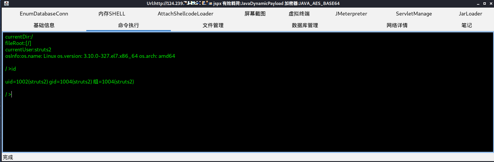

# 0x01 打点发现
队友整理出目标全部OA系统的地址及指纹共7个，包含致远、泛微、等  
对这7个OA系统进行漏洞检测，发现不存在Nday漏洞  
用nmap对这7个OA系统所在ip进行全端口扫描，依次审查每个端口信息，发现其中一个端口支持put、delete方法，比较可疑，使用浏览器访问后发现是.action后缀，怀疑存在struts2漏洞  
# 0x02 漏洞验证
使用struts2漏洞检测工具检测，发现存在s2-045漏洞，尝试执行命令，发现返回connection reset，应该是有waf  
# 0x03 防护绕过
现在有2个思路，要么绕过执行命令的限制，要么上传webshell，先尝试难度相对小一些的上传webshell  
尝试上传jsp格式的webshell，访问后发现403  
尝试上传txt格式的文件，上传后能访问，说明可以上传文件  
猜测，之前的403是因为，目标的web服务器做了限制，不能访问jsp文件  

随后是一系列尝试：  
上传.action格式的文件会返回到首页  
上传随意后缀不能解析  
当上传jspx格式的webshell时能访问，哥斯拉成功连接，如下图  

