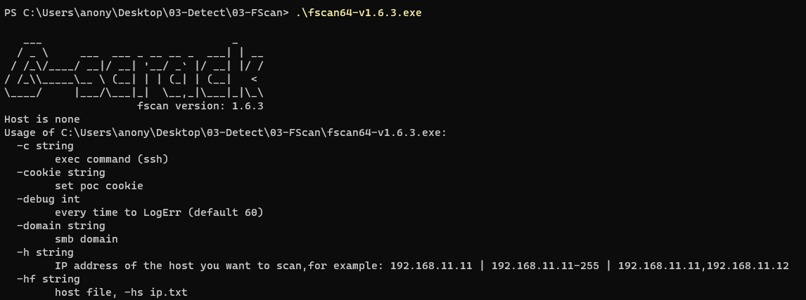

- [0x01-Web漏洞检测--AWVS](#0x01-web漏洞检测--awvs)
- [0x02-Web漏洞检测--Fscan](#0x02-web漏洞检测--fscan)
- [0x03-Web漏洞检测--Xray高级版](#0x03-web漏洞检测--xray高级版)
- [0x04-Web漏洞检测--Goby红队版](#0x04-web漏洞检测--goby红队版)

### 0x01-Web漏洞检测--AWVS
AWVS发布版本：https://www.acunetix.com/support/build-history/  
AWVS最新版本可使用其他师傅打包好的docker镜像，感谢这些师傅：），地址：https://hub.docker.com/r/secfa/awvs  
docker安装问题可参考：https://github.com/ybdt/front-hub/tree/main/18-Docker  
若收集的url结尾不是http://www.baidu.com 或 http://www.baidu.com 或 http://www.baidu.com/pinyin/ ，AWVS会提示检验错误，可使用脚本[beijixing-to-awvs-auxiliary.py](./auxiliary/beijixing-to-awvs-auxiliary.py)处理一下  
  

### 0x02-Web漏洞检测--Fscan
地址：https://github.com/shadow1ng/fscan  
  

### 0x03-Web漏洞检测--Xray高级版
提交几个poc  
xray地址：https://github.com/chaitin/xray  
  

### 0x04-Web漏洞检测--Goby红队版
提交几个poc  
goby地址：https://cn.gobies.org/  
  