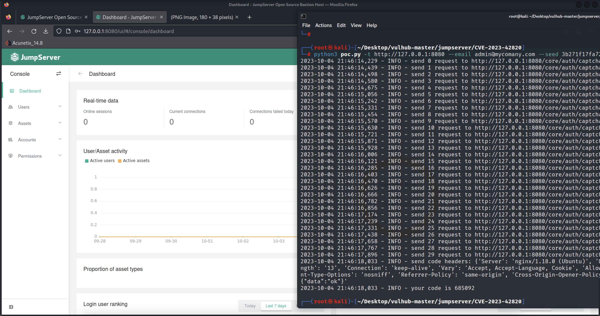

# 漏洞成因
```
由于第三方库django-simple-captcha暴露了随机数种子，可通过api查看，导致了重置密码时的验证码可被猜解，进而可以重置密码
```

# 影响版本
```
v2.24 <= version <= v3.6.4

Patched Version
>= v2.28.19, >= v3.6.5
```

# 漏洞复现
复现过程参见P牛的复现过程就可以，出于绿色环保，我就不再赘述一遍了，只说一下复现后的几点经验
```
我第一遍没打成，第二遍才打成的

当前的jumpserver环境由于管理的资产少，所以发送10次请求就可以猜到重置密码的验证码，实际攻击中，可能需要发送大量请求

漏洞的利用需要知道用户名和邮箱，这个先决条件导致这个漏洞有点鸡肋
```
最后附上一张漏洞利用成功的截图



# Reference
```
https://github.com/vulhub/vulhub/tree/master/jumpserver/CVE-2023-42820
https://github.com/jumpserver/jumpserver/security/advisories/GHSA-7prv-g565-82qp
```