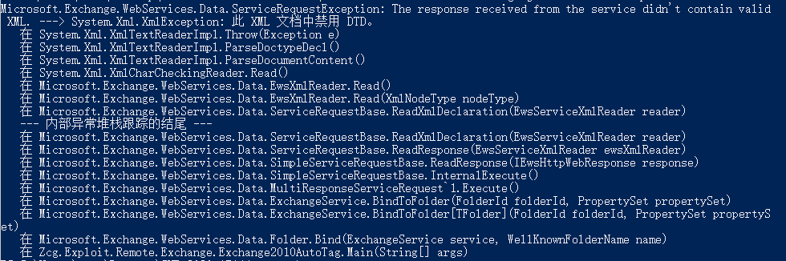

下载https://github.com/zcgonvh/CVE-2020-17144

保证系统有.net framework 3.5的前提下，win10中执行make.bat

访问[https://mail.xxx.com/ews/Exchange.asmx](https://mail.xxx.com/ews/Exchange.asmx)，确保服务端程序存在

执行.\CVE-2020-17144.exe mail.xxx.com username password  
本次执行并未成功，报错如下  
  
从报错提示看，可能是因为目标禁用了xml中的dtd

想进一步知道能否绕过报错，需要学习[漏洞分析](http://www.zcgonvh.com/post/analysis_of_CVE-2020-17144_and_to_weaponizing.html)，最近在考试，有时间再看吧
