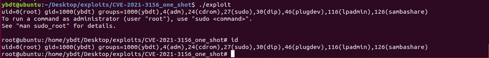
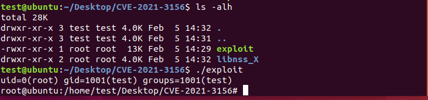

# 0x00 软件介绍
sudo：linux下用于允许系统管理员让普通用户执行一些或者全部的root命令的一个工具

# 0x01 复现环境
使用环境：本地环境（ubuntu18.04.2_x64_en-us）  
复现版本：sudo 1.8.21p2  
环境搭建：  
1、从ubuntu官网下载镜像，并安装

# 0x02 利用条件
无

# 0x03 影响版本
sudo 1.8.2 - 1.8.31p2  
sudo 1.9.0 - 1.9.5p1

不受影响版本  
sudo >= 1.9.5p2

# 0x04 漏洞复现
注意：The libnss_X directory must be present in the present working directory while running the exploit

ubuntu18.04.2_x64_en-us下用户ybdt（在sudo组中）：  
1、首先执行“sudo -s /”检测漏洞是否存在，输出中以“sudoedit:”开头，表明漏洞很可能存在，并查看系统版本，如下图  
  
2、下载攻击代码git clone [https://github.com/r4j0x00/exploits](https://github.com/r4j0x00/exploits)（没有git需要先安装git，“sudo apt install git”）  
3、编译攻击代码make（没有make、gcc需要先安装，“sudo apt install make”，“sudo apt install gcc”）  
4、执行攻击，如下图  

ubuntu18.04.2_x64_en-us下用户test（未在sudo组中）：  
1、查看系统版本，并执行“sudo -s /”检测漏洞是否存在，输出中以“sudoedit:”开头，表明漏洞很可能存在，如下图  
  
2、执行之前编译好的攻击程序，如下图  

我在测试ubuntu20.04.1_x64_en-us的时候，期间出现过一个程序崩溃的提示，并不能成功，如下图  
  

# 0x05 批量脚本
无

# 0x06 参考链接
https://github.com/r4j0x00/exploits/tree/master/CVE-2021-3156_one_shot
