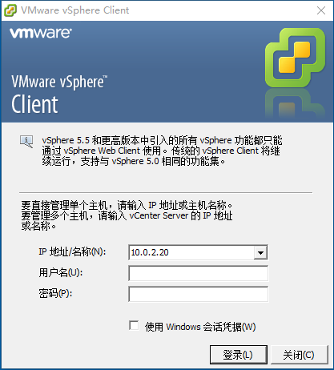
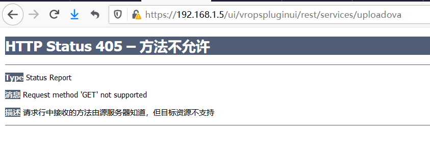
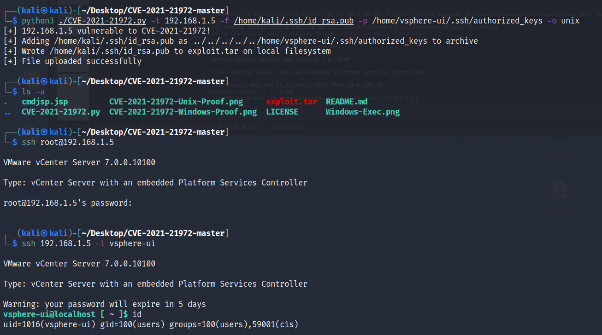
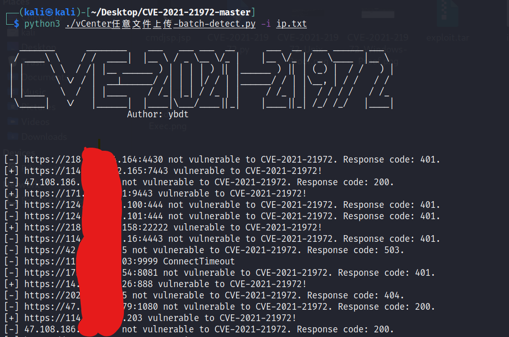

# 0x00-软件介绍
VMware vSphere是一个套件，通常部署在内网中，主要包含VMware ESXi、VMware vCenter Server、VMware vSphere Client这3块  
VMware ESXi：安装在物理机上，负责虚拟化服务  
VMware vCenter Server：通常安装在虚拟机上，负责管理虚拟机  
VMware vSphere Client：通常安装在管理员的笔记本上，负责连接到VMware vCenter Server来管理虚拟机，或直接连接虚拟机  

最后给不熟悉VMware vSphere的同学提一句，关于它们具体都是干什么的，可参考这篇文章https://blog.csdn.net/eastyell/article/details/91581878  
VMware vSphere Client长这样  


# 0x01-复现环境
#### 使用本地搭建的环境：  
win10 1909 x64 + VMware Workstation 16 Pro + VMware-VMvisor-Installer-7.0.0-15843807.x86_64.iso + VMware-VCSA-all-7.0.0-15952498.iso  
#### 复现版本：  
VMware vCenter Server 7.0.0  
### 下载地址：  
```
安装ESXi 7.0.0

VMware vSphere虚拟机监控程序（ESXi）
链接：https://cld16.irans3.com/dlir-s3/VMware-VMvisor-Installer-7.0.0-15843807.x86_64.iso
VMware-VMvisor-Installer-7.0.0-15843807.x86_64.iso档案大小：350 MB
MD5：220d2e87290f50c3508214cadf66b737
SHA1：7fda0401ee1b2f49aae89043f9b2d509cf7e25db
安装：https://blog.51cto.com/10802692/2409826

VMware vCenter Server
链接：https://cld5.irans3.com/dlir-s3/VMware-VCSA-all-7.0.0-15952498.iso
VMware-VCSA-all-7.0.0-15952498.iso档案大小：6.42 GB
MD5：94bb30ae83cd5f12e2eecce114d43007
SHA1：17aa2b1ee20e977fb4f8f8391563f57c3e456361
安装：https://blog.csdn.net/qq_38028248/article/details/107712839

（环境安装参考来源：作者: print("")师傅环境部署）
```
友情提示：使用浏览器下载会超慢，使用迅雷会快很多  
#### 环境搭建过程：  
1、安装VMware ESXi，参考这篇文章[https://blog.51cto.com/10802692/2409826](https://blog.51cto.com/10802692/2409826)，但是我在安装完创建虚拟机时，报错“无法打开虚拟机 CentOS7-x64 的电源。资源不足。 单击此处了解更多详细信息。”，原因未知，先放一边

2、安装VMware vCenter，参考这篇文章[https://blog.csdn.net/qq_38028248/article/details/107712839](https://blog.csdn.net/qq_38028248/article/details/107712839)，我采用解压缩ISO文件并执行安装包的方式，安装过程有几点需要注意：  
2.1）VMware ESXi需要保持开启状态（其实是将VMware vCenter Server这台虚拟机安装到VMware ESXi中）  
2.2）安装过程中，到内存步骤，提示最少需要12GB，实际设置要比12GB多一些，否则会报错  
2.3）安装过程中，到存储步骤，提示最少需要25GB，我在设置的时候分配了142GB，但不知道为什么存储只显示13.75GB，开启VMware ESXi的SSH并登录后发现，有119GB存储的文件系统是VMFS-L，查阅资料[https://www.azurew.com/vmware/esxi-7-0/3792.html](https://www.azurew.com/vmware/esxi-7-0/3792.html)后，添加60GB新存储，在存储->设备中创建存储，至此多出60GB存储空间，至于119GB的VMFS-L先不去管，按照提示，基本一路下一步，成功安装VMware vCenter

# 0x02-利用条件
无

# 0x03-影响版本
VMware vCenter Server 7.0系列 < 7.0.U1c  
VMware vCenter Server 6.7系列 < 6.7.U3l  
VMware vCenter Server 6.5系列 < 6.5 U3n  
VMware ESXi 7.0系列 < ESXi70U1c-17325551  
VMware ESXi 6.7系列 < ESXi670-202102401-SG  
VMware ESXi 6.5系列 < ESXi650-202102101-SG

vCenter版本对比表：  
https://www.virten.net/vmware/vcenter-release-and-build-number-history/

# 0x04-漏洞复现
环境搭建完成后，访问[https://192.168.1.5/ui/vropspluginui/rest/services/uploadova](https://192.168.1.5/ui/vropspluginui/rest/services/uploadova)，返回405，如下图  
  
使用[horizon3ai](https://github.com/horizon3ai/CVE-2021-21972)的工具进行漏洞利用，成功登录ssh，如下图  
  
上述工具针对linux的攻击方式是ssh公钥登录，针对windows的攻击方式是上传cmdjsp.jsp，由于攻击前不确定操作系统版本，故有些低效

可是使用[Sp4ce](https://github.com/horizon3ai/CVE-2021-21972)的工具针对linux和windows进行webshell上传（版本需要小于6.7U2+），更高效一些，如下图  
  

# 0x05-批量脚本
fofa搜索：title="+ ID_VC_Welcome +"  
vCenter任意文件上传-batch-detect.py，使用如下图  
  

# 0x06-参考链接
thelostworld->https://mp.weixin.qq.com/s/jI3kMCq5FMnNkgvKr1tFMg  
Ricter Z->http://noahblog.360.cn/vcenter-6-5-7-0-rce-lou-dong-fen-xi/?continueFlag=542f9390afb74a1758303feb14144afc  
原作者：https://swarm.ptsecurity.com/unauth-rce-vmware/  
print("")->https://mp.weixin.qq.com/s/IjNLS-a464fPJwkdBXCbmA  
360代码卫士->https://mp.weixin.qq.com/s/GRbtvk97QLaTnDDQIA_2vA
