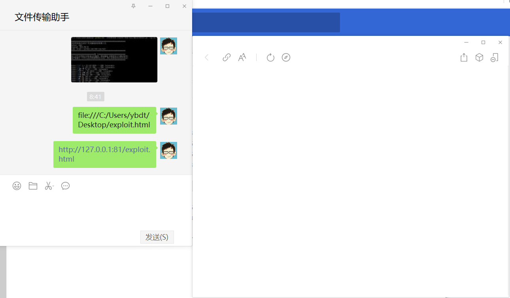

1、查看当前chrome版本为最新的89.0.4389.114（64位），如下图  


2、以非沙盒模式下运行chrome，powershell中切换到chrome安装目录下，执行
```
.\chrome.exe --no-sandbox
```

3、启动后在浏览器中访问exploit.html，如下图  


#### 最后更新于：2021/04/17
Cobalt Strike上线参考这篇文章：https://mp.weixin.qq.com/s/LOpAu8vs8ob85W3sCmXMew  
（2020/04/17日准备复现，再打开Chrome时很快就自动更新到最新版本，故暂不复现）

据说微信内置浏览器使用Chromium内核，且打开网页默认不启用沙箱，尝试复现，结果没有弹出计算器，如下图：  
  

