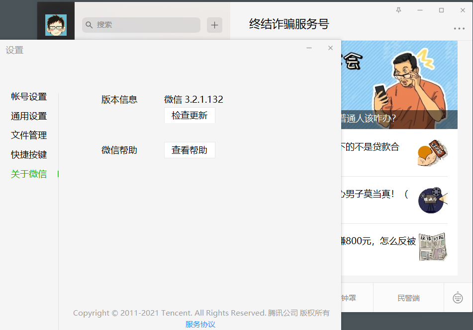

原理：微信内置浏览器使用Chromium内核，且打开网页默认不启用沙箱  
微信版本3.2.1.132，如下图：  

本地起一个HTTP服务，我用的phpstudy，将wechat-exploit.html放入web目录下，微信中访问链接，CS收到反连Shell，如下图  
  

参考链接：  
https://mp.weixin.qq.com/s/LOpAu8vs8ob85W3sCmXMew  
https://mp.weixin.qq.com/s/TC9EDiiZnxGeyM7BP9wZYQ
