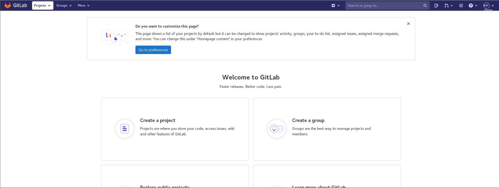

# 0x01 环境搭建
使用环境：CentOS7.6.1810_x64_en-us  
下载rpm安装包：https://packages.gitlab.com/gitlab/gitlab-ce/packages/ol/7/gitlab-ce-13.10.1-ce.0.el7.x86_64.rpm  
安装：sudo rpm -i ./gitlab-ce-13.10.1-ce.0.el7.x86_64.rpm  
修改第1处配置：sudo vim /etc/gitlab/gitlab.rb
```
external_url 'http://192.168.202.133:1028'
nginx['listen_addresses'] = ['*', '[::]']
nginx['listen_port'] = 1028
nginx['listen_https'] = false
```
修改第2处配置：sudo vim /opt/gitlab/embedded/conf/nginx.conf
```
server {
        listen       *:1028;
        server_name  192.168.202.133;
        if ($http_host = "") {
            set $http_host_with_default "ip:1028";
        }
```
临时关闭防火墙
```
sudo systemctl stop firewalld
systemctl status firewalld
```
重新加载配置文件
```
gitlab-ctl reconfigure
```
重启gitlab
```
gitlab-ctl restart
```
成功配置后，访问目标地址如下图  
  
首次访问需要更改密码，此处更改密码对应的是管理员用户：admin@example.com  
通过登录界面的注册功能，注册一个新用户，并登录管理员用户通过注册申请，最终登录普通用户如下图  
  
# 0x02 漏洞复现

# 0x03 参考链接
https://mp.weixin.qq.com/s/cy8OOzHD28Of3zC32S_4ow  
https://github.com/mr-r3bot/Gitlab-CVE-2021-22205  
https://blog.csdn.net/yzd524850313/article/details/113118193  
https://www.jianshu.com/p/56541f6c01a5  
https://www.cnblogs.com/ybit/p/14918949.html  
