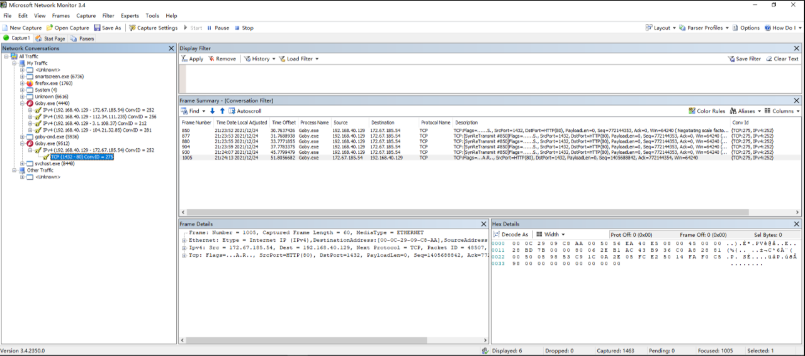
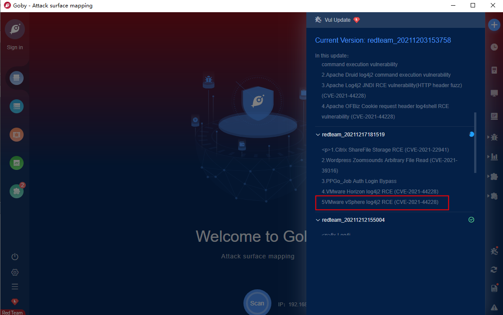

看到goby红队版更新了Apache Solr、Apache Druid、Apache Log4j2 JNDI、Apache OFBiz的RCE，顿时不困了
<!--more-->
想要捕获goby红队版的流量，看能否解密出exp

想用Wireshark，但不知如何过滤指定进程的数据包，google一番，看到的回答都是wireshark不能过滤指定进程的数据包

在stackoverflow上看到一个回答，推荐用微软的Network Monitor，支持进程名过滤
参考链接：https://stackoverflow.com/questions/1339691/filter-by-process-pid-in-wireshark

开始尝试微软的Network Monitor（小坑1：需要以管理员身份运行，否则看不到网卡）
启动Network Monitor，打开firefox和goby红队版，如下图
  
启动更新后和上图相比，发现第2个进程多了一个IP地址：104.21.32.82，尝试入侵发现是Cloudfire节点，难搞，开玩笑了：）
  
查看捕获的网络数据包，没发现什么东西
  
再次查看本地的poc文件，也是乱码的
  
看到更新中还包括“赛门铁克高级威胁保护”、vSphere、等的RCE，真的好馋~
  
  
既然更新时抓包没发现什么，那就试试攻击时抓包，想一下goby红队发包时的逻辑，应该是先识别到目标再发探测包，所以我们需要目标环境，可是vSphere的下载和安装都是个麻烦事啊，怎么办？没事，我们有空间测绘，通过空间测绘寻找目标，然后攻击，最后抓取数据包
```
IPv4.address==3.220.251.239
8.136.140.77
3.1.108.37
```  
抓取后发现目标并不是直接向主机3.220.251.239发起请求，且数据包是加密的

猜测goby红队版是先向一个中间服务器发起请求，再由中间服务器向目标主机发起poc请求，以此实现数据包加密

暂时没有办法！！！