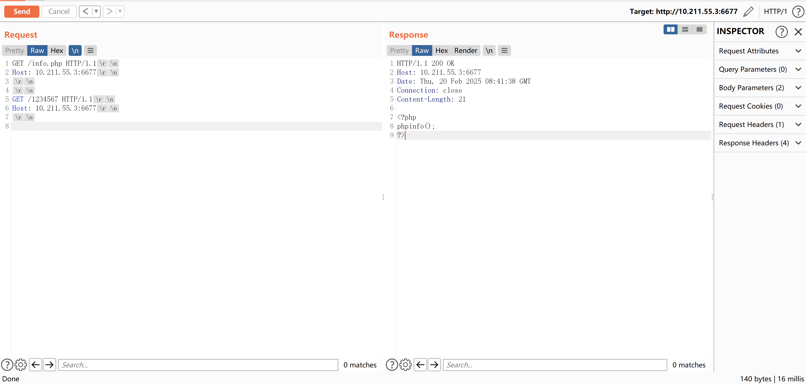

先说下对这个漏洞的基本理解，由php内置的web服务器的漏洞，引发的源码读取漏洞

复现过程
```
安装phpstudy，但不能使用nginx或apache作为web服务器，切换到php所在目录后执行如下命令，我这里以php7.4.3为例：

php.exe -S 0.0.0.0:6677 -n -t C:\phpstudy_pro\WWW

使用burp抓包，需要修改两处，可以参见这里：https://www.freebuf.com/vuls/359359.html

结果复现失败

看了其他文章，猜测可能是是web根目录下的index.html导致的，创建一个新的目录后，重启启动

php.exe -S 0.0.0.0:6677 -n -t C:\phpstudy_pro\WWW\test

burp下重新发包，可读取到源码
```

成功读取到源码  
  