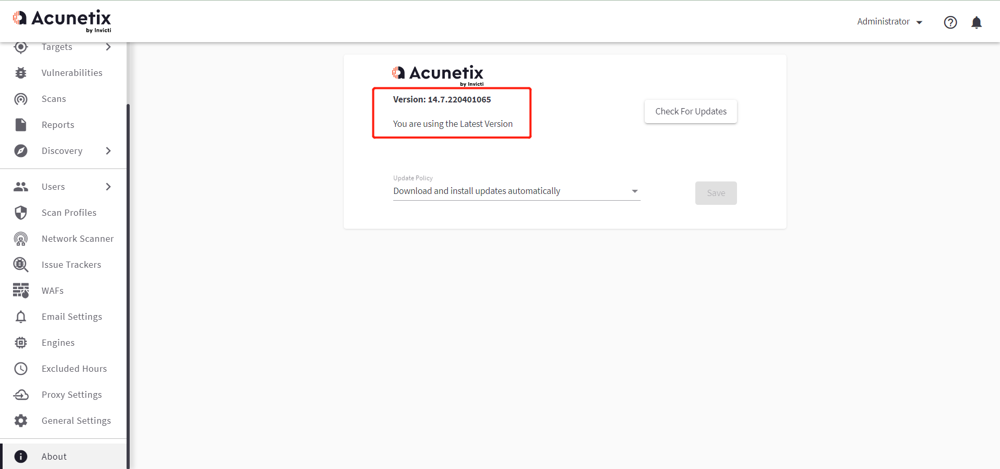

# 0x01-项目起源
很久之前打的一次AWD，让我萌生了将常见漏洞都打一遍的想法

# 0x02-免责声明
该项目仅供授权下使用，禁止使用该项目进行违法操作，否则自行承担后果，请各位遵守《中华人民共和国网络安全法》！！！

# 0x03-漏洞检测
- [01-漏洞检测--AWVS](#01-漏洞检测--awvs)
- [02-漏洞检测--Fscan](#02-漏洞检测--fscan)
- [03-漏洞检测--Xray高级版](#03-漏洞检测--xray高级版)
- [04-漏洞检测--Goby红队版](#04-漏洞检测--goby红队版)

### 01-漏洞检测--AWVS
地址：https://www.acunetix.com/
  

### 02-漏洞检测--Fscan
地址：https://github.com/shadow1ng/fscan  
  

### 03-漏洞检测--Xray高级版
提交几个poc  
xray地址：https://github.com/chaitin/xray  
  

### 04-漏洞检测--Goby红队版
提交几个poc  
goby地址：https://cn.gobies.org/  
  