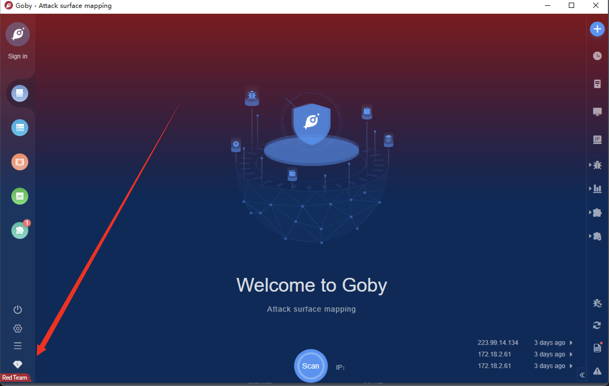

# 0x01-项目起源
很久之前打的一次AWD，让我萌生了将常见漏洞都打一遍的想法

# 0x02-免责声明
该项目仅供授权下使用，禁止使用该项目进行违法操作，否则自行承担后果，请各位遵守《中华人民共和国网络安全法》！！！

# 0x03-漏洞检测
- [01-漏洞检测--AWVS](#01-漏洞检测--awvs)
- [02-漏洞检测--Fscan](#02-漏洞检测--fscan)
- [03-漏洞检测--Xray高级版](#03-漏洞检测--xray高级版)
- [04-漏洞检测--Goby红队版](#04-漏洞检测--goby红队版)

### 01-漏洞检测--AWVS
地址：https://www.acunetix.com/
  

### 02-漏洞检测--Fscan
地址：https://github.com/shadow1ng/fscan  
  

### 03-漏洞检测--Xray高级版
提交几个poc  
xray地址：https://github.com/chaitin/xray  
  

### 04-漏洞检测--Goby红队版
提交几个poc  
goby地址：https://cn.gobies.org/  
  

# 0x04-漏洞复现模板
```
# 0x01-漏洞浅析
# 0x02-影响版本
# 0x03-环境搭建
# 0x04-复现过程
# 0x05-需要注意
# 0x06-参考链接
```

# 0x05-批量检测工具注意事项
```
01、批量检测工具应同时具有单目标检测功能
02、在poc/exp的基础上加入读取文件，写入文件的操作
03、需要处理各类异常，包括：超时、拒绝连接、等等需要不断积累
04、如果想要快速获取结果，可对其他的异常进行统一处理
```

# 0x06-Linux提权漏洞项目
```
GTFOBins项目：https://gtfobins.github.io/
linux-exploit-suggester-2项目：https://github.com/jondonas/linux-exploit-suggester-2
atsud0师傅的Linux提权方式汇总：https://atsud0.me/2020/04/14/Linux%E6%8F%90%E6%9D%83%E6%96%B9%E5%BC%8F/
```

# 0x07-Windows提权漏洞项目
```
hacking8的Windows提权在线辅助工具：https://i.hacking8.com/tiquan/
Kernelhub项目：https://github.com/Ascotbe/Kernelhub
windows-kernel-exploits项目：https://github.com/SecWiki/windows-kernel-exploits
```