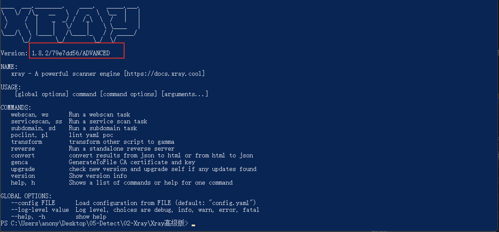

很久之前打了一次AWD，让我萌生了将常见漏洞都打一遍的想法

#### 本项目中所有POC/EXP仅用于学习研究，不可用作恶意攻击！

# 漏洞检测
资产收集完成后，推荐Fscan先对服务弱口令跑一波（尽管概率不大，但还是做一遍，万一有弱口令呢），然后AWVS、Xray、Nuclei对收集到的URL跑一波，最后可以用Goby对收集到的域名采用全端口跑一波

AWVS可以采用基于docker的破解版，Xray的话提交几个POC换取高级版（漏洞更全一些），Goby的话提交几个POC换取红队版（漏洞更全一些）  
  
  
  