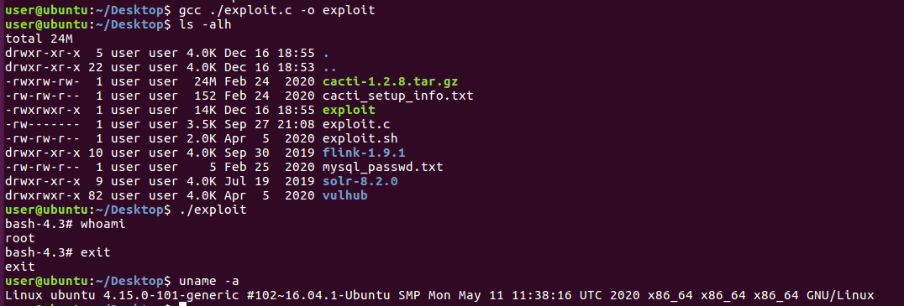

2021/12/17
```
编译测试环境

Linux ubuntu 4.15.0-101-generic #102~16.04.1-Ubuntu SMP Mon May 11 11:38:16 UTC 2020 x86_64 x86_64 x86_64 GNU/Linux

No LSB modules are available.
Distributor ID:	Ubuntu
Description:	Ubuntu 16.04.6 LTS
Release:	16.04
Codename:	xenial
```
编译后运行成功进入root shell，如下图  
  

影响版本：  
Ubuntu 20.10  
Ubuntu 20.04 LTS  
Ubuntu 18.04 LTS  
Ubuntu 16.04 LTS  
Ubuntu 14.04 ESM

参考链接：  
https://mp.weixin.qq.com/s/sNRaeMX04Enxhwyx1297UA  
https://github.com/briskets/CVE-2021-3493
